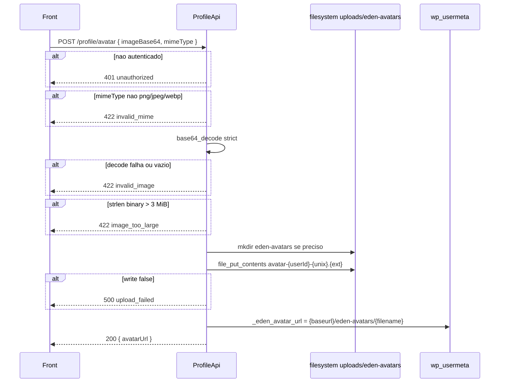

# POST `/profile/avatar`

Documentacao da logica **atual** do upload de avatar (imagem em Base64).

Escopo: validar mime/tamanho, gravar ficheiro em `wp-content/uploads/eden-avatars/` e persistir a URL publica em `_eden_avatar_url`. Nao registra attachment na Media Library.

Plugin: `headless-secure-registration`.

Arquivos principais:

- `wp/wp-content/plugins/headless-secure-registration/src/class-profile-api.php` (`upload_avatar`)
- `wp/wp-content/plugins/headless-secure-registration/src/class-plugin.php` (`get_avatar_data` → override Gravatar)
- testes do filter (nao do POST): `tests/unit/plugin-avatar-filter-test.php`
- alternativa: `PUT /profile/personal` com `avatarUrl` ja hospedada

Namespace REST: `custom/v1`  
Base: `{WP_URL}/wp-json`

---

## 1) Identidade da rota

```
POST /wp-json/custom/v1/profile/avatar
```

| Item | Valor |
|---|---|
| Namespace WP | `custom/v1` |
| Metodo | `WP_REST_Server::CREATABLE` = **POST only** (nao PUT/PATCH) |
| Permission | `ProfileApi::require_auth` |
| Handler | `ProfileApi::upload_avatar` |
| Rate limit | **nao** ha |
| Multipart | **nao** — JSON (ou form) com Base64, nao `$_FILES` |

Objetivo: o app manda a foto recortada em Base64; o WP vira URL absoluta.

Nao confundir com:

- `PUT /profile/personal` `avatarUrl` — so grava URL, sem ficheiro
- Gravatar / `get_avatar()` — o GET do perfil **nao** passa por isso; o filter `get_avatar_data` so afeta wp-admin/tema

Auth identica ao GET.

---

## 2) Fluxo completo



### 2.1 Camada REST (`upload_avatar`)

1. `imageBase64` = string crua.
2. `mimeType` = `sanitize_text_field`, default `'image/jpeg'` se ausente/`null`.
3. Allowlist mime → decode → tamanho → extensao → `wp_upload_dir()` → `wp_mkdir_p` → `file_put_contents` → meta.
4. Nao chama `wp_handle_sideload`, `media_handle_sideload` nem `wp_check_filetype_and_ext`.

---

## 3) Validacoes

| # | Regra | HTTP | `code` | Message |
|---|---|---|---|---|
| 1 | `mimeType` ∈ `{image/png, image/jpeg, image/webp}` | 422 | `invalid_mime` | `Unsupported image type. Use PNG, JPEG, or WebP.` |
| 2 | `base64_decode($base64, true)` nao `false` e length > 0 | 422 | `invalid_image` | `Invalid image data.` |
| 3 | `strlen($binaryData) <= 3 * 1024 * 1024` (3 MiB do **binario**) | 422 | `image_too_large` | `Image must be smaller than 3 MB.` |
| 4 | `file_put_contents` !== false | 500 | `upload_failed` | `Failed to save avatar image.` |

Nao valida:

- magic bytes vs `mimeType` (da para gravar um `.jpg` que e PDF se o client mentir o mime)
- prefixo data-URI (`data:image/png;base64,xxxx`) — o `true` do decode **rejeita** `,` e o upload falha `invalid_image`
- dimensoes / aspect ratio
- conteudo SVG (SVG nem esta na allowlist)
- quota de disco
- autenticidade da imagem (`getimagesize`)

Default `mimeType = image/jpeg`: body so com `imageBase64` e tratado como JPEG.

---

## 4) Dados lidos / gravados

### Lidos

- `WP_User->ID`
- `wp_upload_dir()` → `basedir` / `baseurl` (filters `upload_dir`)

### Gravados

| Destino | Valor |
|---|---|
| Ficheiro | `{basedir}/eden-avatars/avatar-{userId}-{time()}.{png\|jpg\|webp}` |
| usermeta `_eden_avatar_url` | `{baseurl}/eden-avatars/{filename}` |

`time()` = unix seconds — colisao se o mesmo user fizer dois POSTs no mesmo segundo (overwrite).

**Nao** apaga o ficheiro anterior apontado pela meta. Avatares antigos vazam no disco.

**Nao** cria row em `wp_posts` (attachment). Nao gera thumbnails.

PUT personal com `avatarUrl` pode apontar a meta para um host externo; este POST sempre usa o `baseurl` do WP.

---

## 5) Chamadas a backends externos

**Nenhuma HTTP.** Sem S3, Cloudinary, Stripe.

| "Servico" | Tipo | Endpoint | Payload | Resposta | Erro |
|---|---|---|---|---|---|
| Disco local | FS | path `eden-avatars/` | bytes da imagem | bytes escritos ou false | 500 `upload_failed` |
| WordPress usermeta | DB | `update_user_meta` | URL publica | — | silencio (ficheiro ja ficou) |

Se o write do ficheiro ok e a meta falhar, fica orfao no disco e a meta antiga permanece — o handler ainda responde 200 com a URL **nova** montada em memoria.

`wp_upload_dir()` pode devolver `['error']`; o codigo **nao** checa. Nesse caso `basedir` pode ser invalido → 500 no `file_put_contents`.

---

## 6) Hooks / filters do WP envolvidos

| Hook | Papel |
|---|---|
| JWT auth | igual as irmas |
| `upload_dir` | alinha basedir/baseurl (CDN plugins podem reescrever `baseurl`) |
| `wp_mkdir_p` | cria a pasta |
| `updated_user_meta` | meta URL |
| `get_avatar_data` (prio 20, HSR) | **nao** neste POST; requests posteriores de `get_avatar()` usam a nova URL se a meta estiver setada |

Nao dispara `add_attachment` / `wp_generate_attachment_metadata`.

---

## 7) Dependencias e efeitos colaterais

| Recurso | Efeito |
|---|---|
| Filesystem | 1 ficheiro novo por upload; pasta `eden-avatars` criada na primeira vez |
| Permissoes | depende do user do PHP-FPM escrever em `uploads` |
| URL publica | sem `.htaccess` extra; qualquer um com a URL le a foto |
| Cache | meta de user; CDN so se `upload_dir` apontar para um |
| Avatares antigos | orfaos |
| JWT | inalterado |

O GET `/profile` passa a devolver a nova `avatarUrl`. `Plugin::override_avatar_data` faz o wp-admin mostrar a mesma foto no lugar do Gravatar.

---

## 8) Contrato

### Body

```json
{
  "imageBase64": "<base64 sem prefixo data:>",
  "mimeType": "image/jpeg"
}
```

`mimeType` opcional (default JPEG). Extensoes: png → `.png`, jpeg → `.jpg`, webp → `.webp`.

### Sucesso (200)

```json
{
  "success": true,
  "data": {
    "avatarUrl": "https://example.com/wp-content/uploads/eden-avatars/avatar-77-1724030000.jpg"
  }
}
```

### Erros

| HTTP | `code` | Quando |
|---|---|---|
| 401 | `unauthorized` | sem login |
| 403 | `jwt_auth_*` | Bearer invalido |
| 422 | `invalid_mime` | mime fora da lista |
| 422 | `invalid_image` | Base64 invalido / vazio / data-URI |
| 422 | `image_too_large` | binario > 3 MiB |
| 500 | `upload_failed` | disco |

---

## 9) Pontos de atencao para Node

1. Nao aceitar PUT nesta rota se quiser paridade (`CREATABLE` = POST).
2. Object storage (S3) + URL HTTPS; nao depender de `wp-content/uploads`.
3. Validar magic bytes (`file-type`) contra o mime declarado.
4. Aceitar ou rejeitar data-URI de forma explicita — o PHP rejeita.
5. Limite 3 **MiB** no binario (Base64 e ~4/3 disso no wire).
6. Garbage-collect a URL anterior. Nomear com UUID, nao `time()`.
7. Nao servir user-upload sem `Content-Type` correto e sem executar (evitar polyglot HTML).
8. `GET /profile` e `get_avatar_data` devem continuar lendo a **mesma** URL canonica.
9. Personal `avatarUrl` vs este POST: duas portas para a mesma coluna — definir se o Node mantem as duas.
10. Testes: data-URI; mime `image/gif`; 3 MiB + 1 byte; default mime jpeg; dois uploads seguidos nao apagam o primeiro (bug legado a corrigir).

Rota alvo: `POST /api/v1/profile/avatar`.
