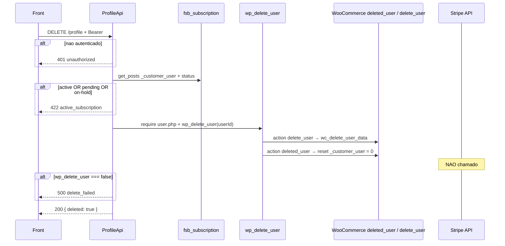

# DELETE `/profile`

Documentacao da logica **atual** da exclusao da conta autenticada.

Escopo: bloquear se houver assinatura "ativa" no CPT `fsb_subscription` e, se livre, chamar `wp_delete_user($userId)` **sem** reassign. Nao cancela Stripe. Nao apaga customer Stripe. Nao revoga JWT/refresh Node.

Plugin: `headless-secure-registration`.

Arquivos principais:

- `wp/wp-content/plugins/headless-secure-registration/src/class-profile-api.php` (`delete_account`, `has_active_subscription`)
- mesma regra de "ativa" do GET: `profile/01-get-profile.md` secao 4.3
- WooCommerce: `wc_delete_user_data` + `wc_reset_order_customer_id_on_deleted_user` em `woocommerce/includes/wc-user-functions.php`
- ledger Stripe: tabela `{prefix}hsr_stripe_subscriptions` (**nao** consultada aqui)

Namespace REST: `custom/v1`  
Base: `{WP_URL}/wp-json`

---

## 1) Identidade da rota

```
DELETE /wp-json/custom/v1/profile
```

| Item | Valor |
|---|---|
| Namespace WP | `custom/v1` |
| Metodo | `WP_REST_Server::DELETABLE` = DELETE (mesmo path do GET) |
| Permission | `ProfileApi::require_auth` |
| Handler | `ProfileApi::delete_account` |
| Rate limit | **nao** ha |
| Body | ignorado (nao pede senha nem confirmacao) |

Objetivo: self-service "apagar minha conta", alinhado a `accountStatus.canDeleteAccount` do GET.

Nao confundir com:

- `POST /custom/v1/subscriptions/{id}/actions` `cancel` — cancela assinatura, nao a conta
- privacy erase WooCommerce (`WC_Privacy`)
- logout Node `POST /api/v1/auth/logout` — so mata refresh

Auth identica ao GET.

---

## 2) Fluxo completo



### 2.1 Camada REST (`delete_account`)

1. `has_active_subscription($userId)` — identico ao GET.
2. `require_once ABSPATH . 'wp-admin/includes/user.php'` (funcao so carrega no admin include).
3. `$deleted = wp_delete_user($userId)` — segundo argumento `reassign` omitido → `null` → **apaga** posts do user em vez de reatribuir.
4. `false` → 500. `true` → 200 `{ deleted: true }`.

Nao pede `currentPassword`. Qualquer Bearer valido apaga a conta (se sem assinatura "ativa").

---

## 3) Validacoes

| # | Regra | HTTP | `code` | Message |
|---|---|---|---|---|
| 1 | auth | 401 / 403 | `unauthorized` / `jwt_auth_*` | ver GET |
| 2 | `has_active_subscription` | 422 | `active_subscription` | `You have an active subscription. Please cancel it before deleting your account.` |

A mensagem e a mesma de `accountStatus.deleteRestrictionMessage` no GET.

Definicao de ativa (copiada do GET):

1. `post_type_exists('fsb_subscription')` falso → **nao** bloqueia (delete segue).
2. Todas as `fsb_subscription` com meta `_customer_user` = user id.
3. Bloqueia se algum `post_status` ∈ `{active, pending, on-hold}`.

Nao bloqueia: `cancelled`, `expired`, `trialing` (status Stripe, nao e post_status WP), `wc-completed`, etc.

**Diverge** do checkout (`user_has_active_subscription` em `{prefix}hsr_stripe_subscriptions` com `active`/`trialing`). Usuario `trialing` no Stripe pode apagar a conta por esta rota se o CPT nao estiver `active|pending|on-hold`.

Nao ha confirmacao de e-mail, cooldown, nem soft-delete.

---

## 4) Dados lidos / gravados

### Lidos

- CPT `fsb_subscription` + postmeta `_customer_user` + `get_post_status`

### Apagados / mutados por `wp_delete_user` (core)

Comportamento padrao WP (reassign `null`):

| Recurso | Efeito |
|---|---|
| `wp_users` | row removida |
| `wp_usermeta` | todas as metas do user (perfil, billing, `_eden_*`, sessions WP, activation) |
| Posts com `post_author` = user | **deletados** (nao reassigned) |
| Links | deletados |

WooCommerce nos hooks:

| Hook | Funcao | Efeito |
|---|---|---|
| `delete_user` | `wc_delete_user_data` | apaga `woocommerce_sessions` (`session_key` = user id), `woocommerce_api_keys`, payment tokens (`WC_Payment_Tokens`) |
| `deleted_user` | `wc_reset_order_customer_id_on_deleted_user` | `_customer_user` / HPOS `customer_id` → `0` nos pedidos (inclui orders e, no postmeta path, qualquer post com essa meta — **assinaturas `fsb_subscription` ficam orfas**, nao apagadas) |

**Nao** tocado pelo HSR:

- Stripe Customer / Subscription (continuam cobrando se ainda `active`/`trialing`)
- `{prefix}hsr_stripe_subscriptions` e ledger
- ficheiros `uploads/eden-avatars/avatar-{id}-*`
- refresh tokens Node `auth_refresh_tokens`
- sessao de onboarding (`hsr_onboarding_sessions`) se existir por user id

---

## 5) Chamadas a backends externos

**Nenhuma HTTP do ProfileApi.** Stripe **nao** e chamado — este e o gap principal.

| "Servico" | Tipo | Endpoint | Payload | Resposta | Erro |
|---|---|---|---|---|---|
| Flexible Subscriptions / WP_Query | DB | `get_posts` CPT | `_customer_user` | ids | CPT ausente → trata como sem assinatura |
| WordPress users | DB | `wp_delete_user` | user id, reassign null | bool | `false` → 500 `delete_failed` |
| WooCommerce | DB | hooks acima | user id | — | nao tratado pelo HSR |
| Stripe | — | **nao chamado** | — | — | cobranca pode continuar |
| Node auth | — | **nao chamado** | — | — | refresh continua na tabela Node |

`wp_delete_user` devolve `false` se o user id for invalido ou se `delete_user` / capabilities falharem em alguns caminhos. Self-delete autenticado costuma ser `true`. Admins deletando a si mesmos tem protecoes em outros fluxos WP; aqui nao ha check `is_super_admin`.

---

## 6) Hooks / filters do WP envolvidos

| Hook | Origem | Papel |
|---|---|---|
| JWT | jwt-auth | auth |
| `pre_get_posts` / `posts_*` | `get_posts` | query assinaturas |
| `delete_user` | `wp_delete_user` **antes** de remover a row | WC sessions/tokens; outros plugins |
| `deleted_user` | `wp_delete_user` **depois** | WC reset customer_id; WebhookUtil WC reassign |
| `delete_userform` etc. | admin UI | **nao** aplica (REST) |

HSR **nao** registra handler em `delete_user`. Nao dispara cancel no `pawbowl-stripe-billing`.

---

## 7) Dependencias e efeitos colaterais

| Recurso | Efeito |
|---|---|
| Conta WP | irreversivel |
| Pedidos WC | permanecem, `customer_id` = 0 |
| `fsb_subscription` posts | permanecem (author provavelmente nao e o customer); meta customer zerada no path postmeta |
| Stripe | assinatura pode seguir viva |
| JWT deste request | a resposta 200 sai; proximos requests: `determine_current_user` devolve id inexistente → `is_user_logged_in()` false → 401 |
| Refresh Node | ainda gera access JWT com `data.user.id` morto ate alguem limpar a tabela |
| Avatares em disco | orfaos |
| Cache object | user cache purged pelo core |

Self-delete com cookie WP: `wp_delete_user` tambem invalida a sessao no processo.

---

## 8) Contrato

### Request

```
DELETE /wp-json/custom/v1/profile
Authorization: Bearer {jwt}
```

Sem body. Sem senha.

### Sucesso (200)

```json
{
  "success": true,
  "data": { "deleted": true }
}
```

### Erros

| HTTP | `code` | Quando |
|---|---|---|
| 401 | `unauthorized` | sem login |
| 403 | `jwt_auth_*` | Bearer invalido |
| 422 | `active_subscription` | CPT com status active/pending/on-hold |
| 500 | `delete_failed` | `wp_delete_user` retornou false |

---

## 9) Pontos de atencao para Node

1. **Unificar "assinatura ativa"** com Stripe (`active`/`trialing`) **antes** de apagar. O PHP e inseguro se o CPT nao existir ou estiver dessincronizado.
2. Ordem sugerida: cancelar/void no Stripe → marcar ledger → soft-delete ou hard-delete user → revogar refresh → apagar avatar storage.
3. Soft-delete (GDPR: anonimizar e-mail, manter orders) vs hard-delete WP. Hoje e hard no user, soft nos orders (`customer_id=0`).
4. Exigir `currentPassword` (hoje nao pede) — breaking, mas fecha conta com JWT roubado.
5. CPT ausente nao pode significar "pode apagar" em producao.
6. Revogar `auth_refresh_tokens` na hora; senao o Node emite JWT zumbi.
7. Alinhar GET `canDeleteAccount` com a **mesma** query que o DELETE usa.
8. Jobs: avatars orfaos, rows `hsr_stripe_subscriptions`, onboarding sessions.
9. Idempotencia: segundo DELETE deve ser 401 (user ja sumiu), nao 500.
10. Testes: status `on-hold` bloqueia; `cancelled` permite; `trialing` so na tabela Stripe (documentar o gap); Stripe **nao** e chamado (assert no legado); Node deve chamar.

Rota alvo: `DELETE /api/v1/profile`.
