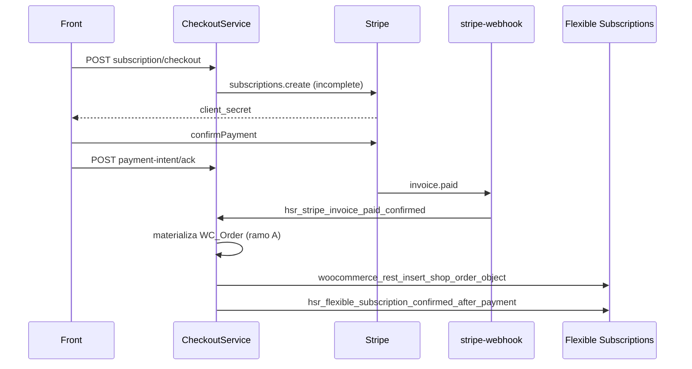

# Stripe, webhook e efeitos do checkout

Parte da serie `POST .../subscription/checkout`.

- Identidade / contrato HTTP: [01-onboarding-subscription-checkout.md](./01-onboarding-subscription-checkout.md)
- Ramo A: [02-ramo-subscription-first.md](./02-ramo-subscription-first.md)
- Ramo B: [03-ramo-order-first.md](./03-ramo-order-first.md)

Este arquivo cobre o que acontece **depois** que o HSR decide criar a subscription: `StripeSubscriptionService::create_subscription`, tax, cupom, idempotencia, persistencia, webhook `invoice.paid`, hooks WP e notas para reimplementacao Node.

Entrada comum:

- ramo A → filter `hsr_checkout_create_stripe_subscription`
- ramo B → action `hsr_checkout_order_ready_for_stripe_sync` → `StripeCheckoutSync::sync_order`

Os dois caem no mesmo `create_subscription`.

---

## 1) `StripeSubscriptionService::create_subscription`

Servico backend: **Stripe Billing API** (`api.stripe.com`), client `\Stripe\StripeClient` via `StripeClientFactory`.

Env:

| Env | Uso | Default no PHP se vazio |
|---|---|---|
| `STRIPE_SECRET_KEY` | `api_key` | 503 `stripe_secret_missing` |
| `STRIPE_API_VERSION` | `stripe_version` do client | omite (SDK default) |
| `STRIPE_MAX_RETRIES` | `Stripe::setMaxNetworkRetries` | **0** (`.env.example` declara `2`) |
| `STRIPE_US_AUTOMATIC_TAX` | `automatic_tax.enabled` se pais US | off (`0`) |

Nao ha HTTP interno PawBowl alem do WordPress. Todas as idas externas deste passo sao Stripe.

`create_subscription` **nao** chama `paymentIntents.create` nem `checkout.sessions.create`. O PI nasce da invoice da subscription (`expand: latest_invoice.payment_intent`).

### 1.1 Validacoes iniciais do payload

- email valido; senao 422 `invalid_customer_email`
- `paymentMethodId` nao vazio; senao 422 `invalid_payment_method`
- `promotion_code_id` se presente deve comecar com `promo_`; senao 422 `invalid_promotion_code_id`
- `items[]` normalizados (cada um `price_` + quantity >= 1); senao 422 `invalid_subscription_items`

`resolve_order_id_for_subscription`: usa `orderId` do payload **ou** procura pedido pela meta `_hsr_onboarding_session_id`. No ramo A o HSR omite `orderId` (0); o resolver ainda pode achar pedido antigo da **mesma sessao**.

### 1.2 Reuse de estado persistido

Se `resolvedOrderId > 0` e o pedido ja tem PI settled (`succeeded|processing|requires_capture`) **ou** `sub_` **ou** status `active|trialing`:

- fingerprint incompativel → 409 `checkout_context_mismatch`
- senao devolve o estado persistido com `reused: true` **sem** novo `subscriptions.create`
- opcionalmente `paymentIntents.retrieve` para reconciliar status (`reconcile_order_payment_intent_status`)

### 1.3 Chamadas Stripe (ordem feliz)

| # | Recurso Stripe | Metodo | Quando | Payload resumido | Resposta esperada |
|---|---|---|---|---|---|
| 1 | Customers | `GET /v1/customers?email=&limit=1` (`customers->all`) | sempre | `email`, `limit: 1` | lista; usa `data[0]` se houver |
| 2 | Customers | `POST /v1/customers` (`customers->create`) | nenhum customer com aquele email | `email`, `name`, `metadata.wp_user_id` | `cus_...` |
| 3 | PaymentMethods | `GET /v1/payment_methods/{pm}` | sempre | id `pm_...` | objeto PM; 422 se retrieve falhar |
| 4 | PaymentMethods | `POST /v1/payment_methods/{pm}/attach` | PM sem `customer` | `{ customer: cus_... }` | PM anexado. Se `customer` **outro** `cus_` → 409 `payment_method_attached_to_other_customer` |
| 5 | Customers | `POST /v1/customers/{cus}` | sempre apos attach | `invoice_settings.default_payment_method`; se address tiver `country`+`postal_code`: `address` + `shipping` | customer atualizado |
| 6 | Prices | `GET /v1/prices/{price}` | **so se** `count(items) > 1` | — | checa mesma `currency` + `recurring.interval` + `interval_count`. Mix → 422 `invalid_subscription_items_mixed_cycle_or_currency`. Retrieve falhou → 502 `stripe_price_retrieve_failed` |
| 7 | Tax Rates | `POST /v1/tax_rates` | US **e** `STRIPE_US_AUTOMATIC_TAX` off **e** percent > 0 | `display_name`, `percentage`, `inclusive: false`, `jurisdiction`, `country: US` | `txr_...` cacheado 7 dias no transient `stripe_tax_rate_{STATE}_{percent}` |
| 8 | Products | `GET /v1/products/{prod}` ou `POST /v1/products` | frete > 0 | name `Shipping`, `tax_code: txcd_92010001` | id em option `hsr_stripe_initial_shipping_product_id` |
| 9 | Subscriptions | `POST /v1/subscriptions` | sempre (se nao reuse) | ver abaixo | `sub_...` + `latest_invoice.payment_intent` expandido |
| 10 | PaymentIntents | `GET /v1/payment_intents/{pi}` | so no **reuse** de pedido com PI existente | — | status atualizado na order meta |

Customer Stripe e resolvido **por email**, nao por `wp_user_id`. Dois WP users com o mesmo email compartilham `cus_`.

### 1.4 Body de `subscriptions.create`

```json
{
  "customer": "cus_...",
  "items": [
    { "price": "price_meal_chicken", "quantity": 2, "tax_rates": ["txr_..."] }
  ],
  "default_payment_method": "pm_...",
  "payment_behavior": "default_incomplete",
  "expand": ["latest_invoice.payment_intent", "latest_invoice.discounts", "discounts"],
  "metadata": {
    "wp_user_id": "42",
    "source": "hsr_headless",
    "hsr_attempt_id": "uuid",
    "onboarding_session_id": "3abf4b2d-...",
    "hsr_items_digest": "abc...",
    "hsr_item_count": "1",
    "hsr_primary_price_id": "price_...",
    "hsr_shipping_rate_id": "...",
    "hsr_shipping_method_id": "...",
    "hsr_shipping_label": "UPS Ground",
    "hsr_shipping_cost": "8.5",
    "hsr_shipping_tax_total": "0.68",
    "hsr_shipping_currency": "USD",
    "hsr_idempotency_key": "hsr-sub-create-...",
    "hsr_promotion_code_id": "promo_...",
    "hsr_initial_shipping_mode": "add_invoice_items",
    "hsr_initial_shipping_amount_minor": "918"
  },
  "automatic_tax": { "enabled": true },
  "discounts": [{ "promotion_code": "promo_..." }],
  "add_invoice_items": [
    {
      "price_data": {
        "currency": "usd",
        "product": "prod_shipping",
        "unit_amount": 850,
        "tax_behavior": "exclusive"
      },
      "quantity": 1,
      "metadata": { "source": "hsr_initial_subscription_shipping" }
    }
  ]
}
```

Regras de montagem:

- `payment_behavior: default_incomplete` — a cobranca **nao** confirma sozinha. Front precisa de `confirmPayment`.
- `automatic_tax.enabled: true` **somente** se flag on **e** pais US. Sem address normalizado (`country` + `postal_code`) nesse ramo → 422 `sales_tax_unavailable`.
- Flag off + US: anexa `tax_rates` em **cada** item (nao no shipping invoice item). US sem state/percent → 422 `sales_tax_unavailable`. Pais != US: sem tax_rates e sem automatic_tax.
- `discounts` so se `promotion_code_id` comeca com `promo_`.
- Frete na 1a invoice (`add_invoice_items`):
  - flag on: `unit_amount` = so `shipping_cost` (tax do frete a Stripe Tax calcula);
  - flag off: `unit_amount` = `shipping_cost + shipping_tax_total`;
  - `shipping_currency` vazio com frete > 0 → 422 `shipping_currency_missing`;
  - conversao major→minor: `stripe_amount_decimal_to_minor` (centavos para USD/BRL);
  - `unit_amount` <= 0 → 422 `shipping_amount_invalid`.
- Ciclos seguintes **nao** herdam esse `add_invoice_items`. Frete recorrente depende do webhook `invoice.created` injetar `invoiceItems.create` a partir das metadata `hsr_shipping_*`.

Pos-create, se `subscriptionId` **ou** `clientSecret` vazio → 502 `stripe_subscription_failed`. Qualquer throw do SDK → 502 `stripe_subscription_failed` com `getMessage()` cru da Stripe.

Resposta interna do servico (nao e o envelope HTTP):

```json
{
  "clientSecret": "pi_..._secret_...",
  "subscriptionId": "sub_...",
  "customerId": "cus_...",
  "status": "incomplete",
  "paymentIntentId": "pi_...",
  "paymentIntentStatus": "requires_confirmation",
  "current_period_end": 0,
  "orderId": 0,
  "hsr_idempotency_key": "hsr-sub-create-...",
  "hsr_attempt_id": "uuid",
  "reused": false
}
```

---

## 2) Idempotencia e lock

Header Stripe `Idempotency-Key`:

```
hsr-sub-create-{wpUserId}-{sha256(email)}-{itemsScope}-{attemptHash16}-{promoScope12}
```

`attemptHash` = primeiros 16 hex de `sha256(attempt_id)`. Sem `attempt_id` estavel no front, **cada POST cria outra subscription**.

Lock WP (nao e Stripe): option `hsr_sub_lock_order_{orderId}` ou `hsr_sub_lock_{attemptHash}`, TTL 120 s. Concorrencia sem estado persistido → 409 `concurrent_subscription_create`. Released no `finally`.

Audit: option `hsr_idempotency_audit` (cap 5000, trim 2000). Log `hsr-idempotency` / `hsr-sub-created`.

Ramo B: `attempt_id` e persistido na order meta `_hsr_attempt_id` **antes** do create, entao retry do mesmo pedido reusa a chave. Ramo A: se o front nao reenviar `attempt_id`, o PHP gera UUID novo a cada request.

---

## 3) Taxa (resumo no ponto de charge)

`ProductTaxService` (HSR) e `StripeTaxRateService` / `automatic_tax` (billing) precisam estar alinhados:

| Cenario | HSR `resolve_from_session` | Stripe `subscriptions.create` |
|---|---|---|
| BR / nao-US | tax 0 | sem `automatic_tax`, sem `tax_rates` |
| US + `STRIPE_US_AUTOMATIC_TAX=1` | placeholder 0 + jurisdiction=state | `automatic_tax.enabled=true`; exige `country+postal_code` |
| US + flag off | `WC_Tax::find_rates` fail-closed | cria/reusa `txr_` e anexa em cada item |

Preview (`POST .../subscription/preview`) **sempre** chama Stripe Tax (`invoices.createPreview`) — desalinhado com o charge quando a flag esta off. Docs: [../subscription-preview/01-onboarding-subscription-preview.md](../subscription-preview/01-onboarding-subscription-preview.md) e [../sales-tax/01-onboarding-sales-tax-quote.md](../sales-tax/01-onboarding-sales-tax-quote.md).

`data.total` do checkout HSR **nao** inclui o imposto Stripe Tax automatico nem o desconto `once` da invoice.

---

## 4) Cupom de 1a compra no charge

Nao ha campo de cupom no body do checkout. Apply:

1. HSR revalida elegibilidade (historico Woo + ledger `hsr_stripe_subscriptions`).
2. Percentual fixo por prazo (10/25/40).
3. Resolve `promo_` via option `pawbowl_stripe_first_purchase_promos`.
4. Stripe recebe `discounts: [{ promotion_code }]`. Duration no Stripe Coupon deve ser `once` (1a invoice).

Elegivel + slot vazio = **503** no ramo A; no ramo B o precheck HSR tambem 503 **antes** de criar o pedido. Se o percent so aparece no sync (meta) e o slot esta vazio, o sync grava `_hsr_stripe_sync_error=first_purchase_promo_not_configured` e o HTTP continua 200.

Contexto: `artefatos/documentacao-plugins-backend/09-stripe-coupons-first-purchase.md` secao 4.7.

---

## 5) Webhook e materializacao

Rota: `POST /custom/v1/stripe-webhook` (`StripeSubscriptionService`). Evento canonico de cobranca: `invoice.paid`.

```
do_action('hsr_stripe_invoice_paid_confirmed', $orderId, $subscriptionId, $eventId, $correlationId, $eventType);
```

Listeners:

| Priority | Classe | Efeito |
|---|---|---|
| 10 | `CheckoutService::on_stripe_invoice_paid_confirmed` | materializa Woo order (ramo A) + Flexible |
| 20 | `StripeRenewalGuard::on_invoice_paid_confirmed` | guarda renovacao |
| (plugin billing) | materializa edit pendente de plano se houver | limpa `_hsr_edit_pending_*` |

### 5.1 `CheckoutService::on_stripe_invoice_paid_confirmed`

1. Se `orderId <= 0`, tenta `materialize_order_from_subscription_first($subscriptionId)`:
   - ja existe pedido com meta `_hsr_stripe_subscription_id` → reusa;
   - senao `find_by_stripe_subscription_id` na sessao (`LIKE` no JSON);
   - cria `WC_Order` com lines/endereco/shipping/metas equivalentes ao ramo B;
   - `payment_complete(pi_...)`;
   - grava `session.checkout_order_id`.
2. Se `_hsr_checkout_deferred_local_subscription !== '1'`, return (ja materializado).
3. `do_action('woocommerce_rest_insert_shop_order_object', $order, null, true)` — trigger intencional para Flexible criar `fsb_subscription`.
4. Persiste `_hsr_flexible_subscription_ids`; zera a flag deferred se criou.
5. Copia `_hsr_shipping_*` para cada sub Flexible.
6. `do_action('hsr_flexible_subscription_confirmed_after_payment')` → `StripeCheckoutSync::bind_confirmed_flexible_subscription` (customer/sub ids + contract end date).

`invoice.created` (outro handler, nao este POST): injeta frete recorrente. Sem esse worker, o cliente paga frete uma vez e some.

Fonte de verdade de cobranca e o webhook, **nao** o `POST .../payment-intent/ack` (o ack so persiste status local para a UI).

---

## 6) Hooks e filters do WordPress

### 6.1 Especificos desta rota / checkout

| Tipo | Hook | Onde | Efeito |
|---|---|---|---|
| action | `rest_api_init` | `Plugin::boot` | registra a rota |
| filter | `hsr/onboarding_rate_limit_max` | `consume_onboarding_limit` | max do bucket **auth**. Args `($maxAttempts, 'auth')` |
| filter | `hsr/onboarding_rate_limit_window` | idem | janela em segundos |
| filter | `hsr/onboarding_ttl` | `OnboardingRepository::ttl` | TTL do transient `hsr_onb_*` (default 172800) |
| filter | `hsr_checkout_create_stripe_subscription` | `checkout_subscription_first` | unico ponto de criacao Stripe no ramo A. Default `null`. Listener: `PawBowlStripe\Plugin` → `create_subscription` |
| action | `hsr_checkout_order_ready_for_stripe_sync` | ramo B (create e retry) | `StripeCheckoutSync::sync_order`. Args: `($order, $context)` com `flow` = `order_first_checkout` ou `order_reuse_retry` |
| action | `hsr_stripe_invoice_paid_confirmed` | **nao** neste POST; webhook | `CheckoutService::on_stripe_invoice_paid_confirmed` materializa order (ramo A) e Flexible Subscription |
| action | `woocommerce_rest_insert_shop_order_object` | apos invoice paid | trigger intencional para o plugin Flexible criar `fsb_subscription` |
| action | `hsr_flexible_subscription_confirmed_after_payment` | apos materializar | `StripeCheckoutSync::bind_confirmed_flexible_subscription` copia metas Stripe/shipping para a sub Flexible |
| action | `hsr_flexible_subscription_created_before_stripe_sync` | bridge Flexible | outro caminho de sync (nao e o onboarding checkout direto) |
| filter | `rest_allowed_cors_headers` | `Plugin::allow_rest_cors_headers` | libera `x-session-token` |
| filter | `determine_current_user` | jwt-auth | autentica JWT no REST |
| filter | `jwt_auth_expire` | jwt-auth | TTL do JWT (default 7d) |

`hsr/onboarding_token_ttl` **nao** e lido aqui (esta rota nao valida session token).

Filters globais do `RateLimiter` (`hsr/rate_limit_max`, `hsr/rate_limit_window`) **nao** se aplicam: onboarding usa `consume_with_limits` com valores explicitos.

### 6.2 Core WP / Woo envolvidos

| API | Uso |
|---|---|
| REST (`register_rest_route`, `permission_callback`) | roteamento |
| `is_user_logged_in` / `get_current_user_id` / `get_user_by` | auth + email |
| `get_user_meta` (`hsr_activation_status`) | conta ativa |
| `get_post_meta` (`_stripe_price_ids_by_currency`, `_stripe_price_id`, `stripe_price_id`) | mapa Price |
| `$wpdb` | sessao, pets, ledger `hsr_stripe_subscriptions` (elegibilidade) |
| `get_transient` / `set_transient` | rate limit; cache sessao `hsr_onb_*`; cache `txr_` |
| `get_option` / `update_option` / `add_option` | promos, lock `hsr_sub_lock_*`, shipping product, audit, maps |
| `wc_create_order` / `wc_get_order` / `wc_get_orders` / `wc_get_product` | pedido |
| `WC_Tax::find_rates` / `calc_exclusive_tax` | tax US se flag off |
| `WC_Order_Item_Shipping` | frete no pedido |
| `wc_get_logger` | `hsr.present_checkout`, `hsr-idempotency`, `hsr-sub-created`, `pawbowl.stripe_sync`, `hsr-first-purchase-promo` |
| `sanitize_text_field` / `sanitize_email` / `sanitize_textarea_field` | inputs |
| `__()` | i18n EN |
| `wp_generate_uuid4` | attempt_id / checkout_trace_id |
| `hash('sha256')` / `hash_equals` | fingerprint e idempotency |

Nao usa carrinho Woo (`WC_Cart`), Checkout Session Stripe, nem REST de cupons Woo.

---

## 7) Dependencias e efeitos colaterais

### 7.1 O que e lido

- Path: `session_id`.
- Headers: `Authorization` (JWT). `X-Session-Token` ignorado no permission.
- Body: `checkout_mode`/`flow`, `payment_method_id`/`paymentMethodId`, `priceId`/`price_id`, `attempt_id`, `billing.{first_name,last_name,email,phone,company}`, legado `product_id`/`variation_id`/`quantity`.
- SQL sessao: `{prefix}hsr_onboarding_sessions` + `{prefix}hsr_onboarding_pets`.
- `plan_selection_json` (catalog_pricing, shipping, product_tax, subscription_term_months).
- `zipcode_json`, `questionnaire_json`, `recurrence_json`, `linked_user_id`, `checkout_order_id`, `stripe_checkout_json`.
- User: email, meta `hsr_activation_status`.
- Woo orders do usuario (historico de compra).
- `{prefix}hsr_stripe_subscriptions` (assinatura ativa).
- Option `pawbowl_stripe_first_purchase_promos`.
- Post meta de produto/variacao (Price IDs).
- Woo tax tables (US, flag off).
- Env Stripe / `STRIPE_US_AUTOMATIC_TAX`.
- Pedido Woo existente (reuso / fingerprint).

### 7.2 O que e gravado (por ramo)

| Recurso | `subscription_first` | `order_first` |
|---|---|---|
| `plan_selection_json` (desconto recalculado) | sim (save comum) | sim |
| `checkout_order_id` | nao neste POST (fica 0/null) | sim, id Woo |
| `stripe_checkout_json` | sim | nao (estado vai para order meta) |
| `{prefix}hsr_onboarding_pets` | **sim** (`replace_pets` no save comum) | **sim** |
| transient `hsr_onb_{sessionId}` | sim | sim |
| transient rate limit | sim | sim |
| Pedido Woo + metas `_hsr_*` | **nao agora** (webhook) | **sim** |
| Stripe Customer / PM attach / Subscription / Invoice / PI | sim | so se `pm_` |
| `{prefix}hsr_stripe_subscriptions` | sim (create) | sim se sync |
| option lock `hsr_sub_lock_*` | sim (TTL 120s, released no finally) | sim se sync |
| option `hsr_idempotency_audit` | sim | sim se sync |
| option `hsr_stripe_subscription_order_map` | sim (order_id 0) | sim |
| option `hsr_stripe_initial_shipping_product_id` | se frete > 0 | se frete > 0 e sync |
| option `pawbowl_stripe_first_purchase_promo_misconfig_count` | se slot vazio | se slot vazio **no sync** (HTTP 200) |
| transient `stripe_tax_rate_*` | US flag off | US flag off + sync |
| Flexible `fsb_subscription` | **nao** neste POST | **nao** neste POST |
| WC cart / session PHP do shopper | nao | nao |

### 7.3 Consumidores posteriores

| Consumidor | O que le |
|---|---|
| Front Payment Element | `data.stripe_client_secret` |
| `POST .../payment-intent/ack` | order meta **ou** `session.stripe_checkout` se `order_id=0` |
| `GET .../payment-methods` | `_hsr_stripe_customer_id` no pedido da sessao |
| Webhook `invoice.paid` | metadata `onboarding_session_id` / map sub→order; dispara materializacao + Flexible |
| Webhook `invoice.created` | injeta frete recorrente (`invoiceItems.create`) — **nao** este POST, mas depende das metadata de shipping gravadas no create |
| Admin Woo `OrderOnboardingMetabox` | JSON das metas `_hsr_*` |
| `GET` sessao | `checkout_order_id`; o JSON `stripe_checkout` **nao** vai no serializer publico |

GET sessao expoe `checkout_order_id`. O front do checkout deve guardar `client_secret` da resposta deste POST.

### 7.4 Sem efeitos em

- `POST .../subscription/preview` (nao e chamado; preview nao e reusado).
- Catalogo `custom-meal-plan-builder` (nao recalcula preco; usa snapshot).
- ViaCEP / Zippopotam / Nominatim / OSRM.
- Criacao de Promotion Code (so **aplica** o `promo_` ja mapeado).
- `paymentIntents.create` explicito.

---

## 8) Sequencia pos-checkout



---

## 9) Pontos de atencao para reimplementacao em Node

1. **Dois ramos no mesmo path.** O PHP escolhe por `checkout_mode === 'subscription_first'`. Smoke/Postman exercitam o outro. No Node, **padronizar um** (recomendado: `subscription_first` + webhook materializando pedido) e versionar o contrato. Se precisar compat com o front atual, aceitar os dois ate o cutover.

2. **Auth desta rota e JWT de usuario + ownership, nao session token.** Copiar `require_valid_session_access` aqui seria **mudar** o comportamento. Recomendado no Node: exigir **os dois** (session token **e** user vinculado) — e melhoria de seguranca, documentar como breaking se o front so manda JWT.

3. **Gate Woo no topo e acidente historico no ramo A.** `subscription_first` nao cria order na hora, mas 503 se Woo estiver down. Node nao precisa de Woo para cobrar; precisa de catalogo de Prices + snapshot da sessao.

4. **`replace_pets` em todo `save`.** O save comum (desconto + zerar order id) regrava todos os pets. No Node, UPDATE pontual de `plan_selection` / `stripe_checkout` **sem** reescrever pets.

5. **Fingerprint incompleto.** Nao entra shipping, endereco, tax, `pm_`. Reuso de pedido com frete/CEP mudado e um bug a **nao** copiar. Incluir no hash: shipping snapshot, zipcode, tax, items Stripe, promo id.

6. **Idempotencia depende de `attempt_id` do cliente.** Sem ele, PHP gera UUID novo → nova `subscriptions.create`. No Node: exigir `Idempotency-Key` HTTP **ou** `attempt_id` persistido na sessao no primeiro POST e reusar. Nao gerar attempt novo no retry.

7. **Customer Stripe por email, nao por `wp_user_id`.** Dois WP users com o mesmo email compartilham `cus_`. PM anexado ao `cus_` de outro user → 409. No Node, chave natural = `user_id` interno com unique email; nao fazer `customers.list(email)` cego se puder guardar `stripe_customer_id` no usuario.

8. **`payment_behavior: default_incomplete`.** A cobranca **nao** confirma sozinha. Front precisa de `confirmPayment`. Sem ack/webhook, a sub fica `incomplete` e o cupom ja esta na subscription (a invoice 1 ainda nao foi paga).

9. **Total da response HSR != invoice Stripe.** Cupom `once` e Stripe Tax alteram o valor cobrado. `data.total` e soma local (subtotal Woo/catalogo + tax placeholder + frete). Para o resumo fiel, preferir `latest_invoice.amount_due` da Stripe (comportamento **novo**, melhor). Se copiar o PHP, aceite a divergencia.

10. **Flag `STRIPE_US_AUTOMATIC_TAX`.** Default repo `0`: tax via Woo `WC_Tax` + `tax_rates` manuais (`txr_`). Flag `1`: `product_tax=0` no HSR e `automatic_tax` no create; address `country+postal_code` obrigatorio. Preview (`subscription/preview`) **sempre** chama Stripe Tax — desalinhado. No Node, **um** modo de tax no preview e no charge.

11. **Frete so na 1a invoice via `add_invoice_items`.** Ciclos seguintes dependem do webhook `invoice.created` injetar `invoiceItems`. Sem esse worker, o cliente paga frete uma vez e some. Reimplementar os dois (create + webhook) ou usar Stripe Shipping Rates / item recorrente consciente.

12. **Mapeamento Price e post meta Woo.** `_stripe_price_ids_by_currency` por moeda; fallback legado. Lines sem mapa sao dropadas em silencio ate zerar a lista (422). No Node, falhar **na line** (`unmapped_variant`) em vez de pular. Quantity somada por `price_` — igual ao PHP.

13. **Cupom 1a compra e fail-closed para elegiveis.** Usuario elegivel + slot vazio = **503**, nao checkout cheio. Inelegivel segue sem `discounts`. Pedido `pending` conta como compra previa (pode queimar o desconto apos um order-first abandonado). No Node, nao contar checkout incompleto como compra.

14. **Ramo B engole erro Stripe em HTTP 200.** `stripe_sync_error` no body. Front desatento acha que deu certo. Nao copiar: sync falho deve ser 502/422. `payment_state: sync_error` existe por causa disso.

15. **Materializacao tardia no ramo A.** Webhook `invoice.paid` cria o Woo order e a Flexible sub. Lookup por `LIKE` no JSON e fragil. No Node: tabela `stripe_checkout` com `stripe_subscription_id` indexado; outbox do webhook.

16. **Lock de create e option WP, TTL 120s.** Nao e Redis. Stale lock pode 409. No Node: lock por `(user_id, attempt_id)` com TTL curto e wait/retry.

17. **`STRIPE_MAX_RETRIES` vazio = 0 no PHP.** `.env.example` diz 2. Escolher default 2 consciente.

18. **502 vaza texto da Stripe.** Mapear `resource_missing`, card errors, `idempotency_error`. Nao devolver secret/stack.

19. **Sem schema de body.** Aceitar camelCase e snake_case para `payment_method_id` / `price_id`. No Node, um schema (zod) com os dois aliases.

20. **i18n.** Messages EN via `__()`. Front deve casar `code`. Manter os mesmos codes no cutover.

21. **Rate limit.** So auth 300/300s. Checkout e pago (Stripe + lock). Vale limite proprio (ex. 10/min por user) — melhoria, nao copia.

22. **Envelope.** Sucesso `{ success, data }`. Erro WP `{ code, message, data.status }`. O doc 08 sugere `{ success: false, error: { code, message } }`. Traduzir na borda HTTP se o front novo usar o envelope 08; o front atual espera WP_Error cru.

23. **Contrato Node sugerido:** `POST /api/v1/onboarding/sessions/:sessionId/checkout`. Manter `data.stripe_client_secret`, `payment_state`, `reused`, `attempt_id`. Preferir nao devolver `payment_url` Woo.

24. **Ordem de jornada.** Sem `account-link` + OTP `active`, 422/403. Sem shipping quando o produto envia, 422. O Node deve falhar com os mesmos `session_incomplete` para o stepper do front continuar funcionando.

25. **Testes a cobrir no Node:** JWT errado → 403; conta pending → 403; sem plan snapshot → 422; sem shipping quando precisa → 422; `subscription_first` sem `pm_` → 422; elegivel sem promo map → 503; inelegivel cria sub **sem** `discounts`; mesmo `attempt_id` → reused, sem segunda sub; `attempt_id` novo → **nao** duplicar se a sessao ja tem `sub_incomplete` (corrigir o PHP); fingerprint/shipping change → nao reusar pedido stale; US flag on sem ZIP → 422; BR sem tax_rates; falha Stripe → 502 no ramo A; webhook paid materializa pedido uma vez so (idempotente).
