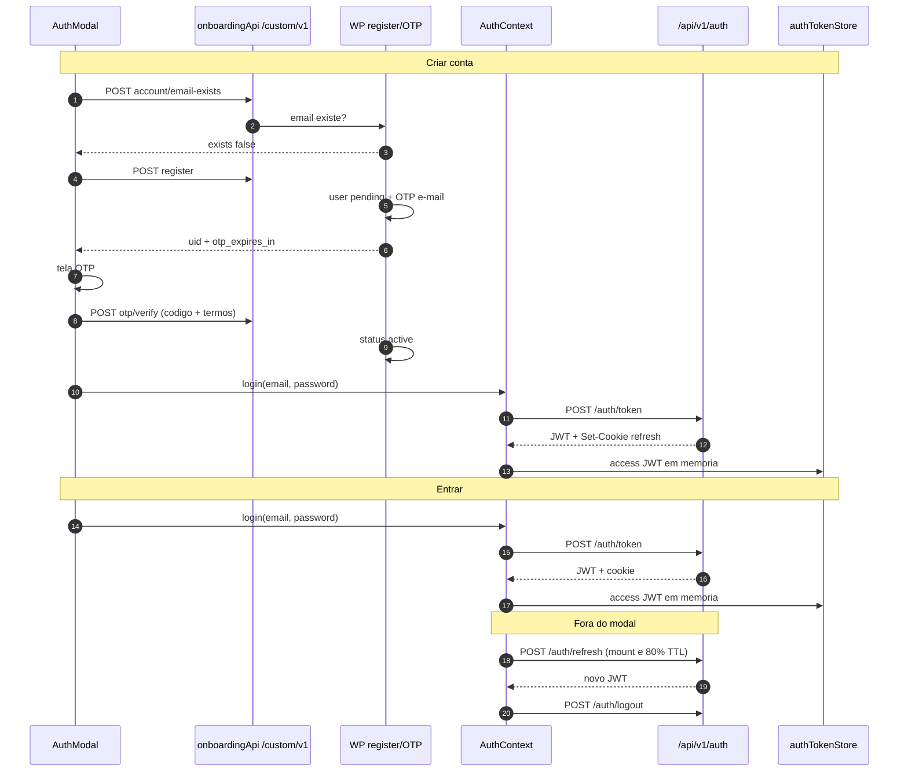

# Auth: criar conta e entrar (contrato Node + JWT)

Contrato das rotas de autenticacao chamadas pelo `AuthModal`.

Nao existe sessao PHP, `sessionId`, `session_token` nem `x-session-token` neste fluxo. Identidade no Node e **JWT de acesso** (em memoria no browser) + **refresh opaco** (cookie HttpOnly). O `userId` vem da claim `data.user.id` do JWT.

## Estado atual

| Fluxo | Onde vive | Auth |
|---|---|---|
| Login, refresh, logout, me | Node `api/v1/auth` | JWT + cookie de refresh |
| Signup / OTP | ainda WordPress `custom/v1` | publico, sem cookie, sem Bearer |
| Rotas de onboarding/subscriptions depois do login | Node `api/v1/*` | `Authorization: Bearer <jwt>` |

O `eden-bowls-backend` **nao** registra `/custom/v1/*`. Signup/OTP continuam no WP ate existir `/api/v1/auth/register|otp/*`. Depois do OTP, o login automatico ja e Node.

Fontes:

| Camada | Arquivo |
|---|---|
| UI | `eden-bowls/src/components/ui/AuthModal.tsx` |
| Signup/OTP client | `eden-bowls/src/services/onboardingApi.ts` |
| Login / refresh / logout | `eden-bowls/src/contexts/AuthContext.tsx` |
| Access JWT em memoria | `eden-bowls/src/services/authTokenStore.ts` |
| Rotas Node | `src/api/routes/auth.routes.js` |
| Service | `src/services/auth.service.js` |
| JWT HS256 | `src/core/jwt-token.js` |
| Senha WP | `src/core/wordpress-password.js` |
| Usuario | `src/infrastructure/repositories/auth.repository.js` (`wp_users` + `wp_usermeta`) |
| Refresh | `src/infrastructure/repositories/auth-refresh-token.repository.js` (`auth_refresh_tokens`) |
| Bearer nas demais rotas | `src/api/middleware/bearer-token.middleware.js` |

Namespace WP (so signup/OTP): `custom/v1` via `VITE_API_BASE_URL`.  
Namespace Node: `api/v1/auth` via `VITE_AUTH_API_BASE_URL` (senao a origin do browser).

---

## Modelo de identidade (JWT, nao session)

```
Browser                         Node
-------                         ----
authTokenStore (memoria)   -->  Authorization: Bearer <jwt>
  access JWT                    verifyJwtToken → request.currentUser.id

cookie HttpOnly            -->  so em /api/v1/auth/refresh e /logout
  eden_refresh_token            SHA-256 em auth_refresh_tokens
  Path=/api/v1/auth             JS nao le esse cookie
```

1. Access JWT e curto (default **900 s**). Vive so em memoria (`authTokenStore` + state do `AuthContext`). Some no reload.
2. Refresh e opaco (64 bytes base64url), **nao e JWT**. O Node persiste so o hash SHA-256. O valor cru vai no cookie `eden_refresh_token`.
3. Reload: `AuthProvider` chama `POST /api/v1/auth/refresh` com `credentials: 'include'`. Sucesso devolve um **novo access JWT** + usuario. Nao reconstitui sessao; emite JWT de novo.
4. Demais rotas `/api/v1/*` (exceto `POST /auth/token` e legado `/onboarding/session/...`) leem `Authorization: Bearer`. Sem header, seguem anonimas. JWT invalido/expirado → `403 jwt_auth_invalid_token`.
5. Nao ha `GET` de sessao. `GET /api/v1/auth/me` existe, mas o front **nao** chama: o usuario vem no body de `token` / `refresh`.

---

## 1) Mapa do que o front chama

### 1.1 Criar conta (`AuthModal` → `onboardingApi.ts`)

Todas `POST`. Base: `VITE_API_BASE_URL` (`resolveBaseUrl()`). Sem cookie, sem Bearer.

| Metodo | Rota | Quando | Backend |
|---|---|---|---|
| POST | `/custom/v1/account/email-exists` | Submit do signup, antes de criar | WordPress |
| POST | `/custom/v1/register` | E-mail livre | WordPress |
| POST | `/custom/v1/otp/verify` | Tela OTP, codigo + termos | WordPress |
| POST | `/custom/v1/otp/resend` | Reenvio (opcional, countdown 10 s) | WordPress |
| POST | `/api/v1/auth/token` | Login automatico apos OTP | **Node** |

### 1.2 Entrar na conta (`AuthModal` → `AuthContext`)

Base: `VITE_AUTH_API_BASE_URL` (senao `window.location.origin`). Sempre `credentials: 'include'`.

| Metodo | Rota | Quando | Backend |
|---|---|---|---|
| POST | `/api/v1/auth/token` | Submit do login **e** apos OTP no signup | Node |
| POST | `/api/v1/auth/refresh` | Ao carregar o app e ~80% da vida do JWT | Node |
| POST | `/api/v1/auth/logout` | Sign out | Node |

Refresh e logout ficam no `AuthContext`, nao no modal.

Telas que abrem o login: `/`, `/plan` ou `/onboarding`.

---

## 2) Sequencias

### 2.1 Entrar

```
Log in (/, /plan ou /onboarding)
  → POST /api/v1/auth/token
  → Set-Cookie eden_refresh_token (HttpOnly)
  → JWT de acesso em memoria
```

1. `AuthModal.handleLoginSubmit` valida e-mail/senha no cliente.
2. `AuthContext.login(email, password)` envia `{ username: email, password }` com `credentials: 'include'` e `X-Requested-With: XMLHttpRequest`.
3. Node autentica contra `wp_users` (phpass `$P$`/`$H$` ou MD5 legado) e le `hsr_activation_status`.
4. JSON: `token` + dados publicos do usuario. Refresh **nao** vai no JSON.
5. Cookie `eden_refresh_token` (`HttpOnly`, `Path=/api/v1/auth`).
6. Front guarda o JWT em `authTokenStore`. Usuario fica no state do `AuthContext`.

### 2.2 Criar conta

```
Signup
  → POST /custom/v1/account/email-exists
  → POST /custom/v1/register
  → tela OTP
  → POST /custom/v1/otp/verify
  → POST /api/v1/auth/token   (login automatico Node)
```

1. Validacao local (nome, e-mail, senha, confirmacao).
2. Se `exists === true`, o modal marca o campo e-mail e **nao** chama `register`.
3. `register` cria usuario pendente, gera OTP de 6 digitos e envia e-mail (WP).
4. Modal guarda `{ uid, email, password }` em memoria (`verifyContext`) e abre a tela OTP.
5. Confirmacao exige codigo completo **e** checkbox de termos (o mesmo valor vai em `termsAccepted` e `privacyAccepted`).
6. OTP ok → `login(email, password)` no Node (mesmo contrato do item 2.1).
7. Modal vai para tela de sucesso.

A senha fica so no state do modal ate o login automatico. Nao persiste.

Conta pendente **nao** autentica no Node: `AuthService.authenticate` devolve `403 account_pending_activation`.

### 2.3 Refresh (AuthContext, fora do modal)

1. Mount do `AuthProvider` → `POST /api/v1/auth/refresh`.
2. Sucesso → aplica o novo JWT + usuario (mesmo shape do token).
3. Falha → `expireAuth()` (limpa JWT/usuario; **nao** limpa rascunho de onboarding).
4. Com JWT valido, agenda novo refresh em `iat + 0.8 * (exp - iat)`.

### 2.4 Logout (AuthContext)

1. `POST /api/v1/auth/logout` (fire-and-forget).
2. Limpa JWT em memoria e usuario.
3. `clearOnboardingState()` (rascunho anonimo + fotos).

---

## 3) Duas bases e dois envelopes

| Fluxo | Env | Default | Cookie |
|---|---|---|---|
| Signup/OTP (`/custom/v1`) | `VITE_API_BASE_URL` | origin do browser | nao |
| Auth Node (`/api/v1/auth`) | `VITE_AUTH_API_BASE_URL` | origin do browser (`localhost:3000` no SSR) | sim (`credentials: 'include'`) |

Envelope WordPress (`/custom/v1`):

```json
{
  "success": true,
  "message": "...",
  "data": {},
  "meta": { "request_id": "..." }
}
```

Erro WP: `success: false` + `error.code` / `error.message` / `error.data`. O front le isso em `assertAuthOk`.

Envelope Node (`/api/v1/auth/token` e `/refresh`):

```json
{
  "token": "<jwt>",
  "user_email": "user@example.com",
  "user_nicename": "username",
  "user_display_name": "Display Name"
}
```

Erro Node de auth (`HttpError` com `details.code`): `{ "code", "message", "data": { "status" } }` (sem wrapper `success`).  
Validacao 400 do token (Zod): `{ "success": false, "message": "Invalid request payload." }`.

O WP `register` / `otp/verify` ainda pode devolver `data.token_endpoint = jwt-auth/v1/token`. O front **ignora** e chama `/api/v1/auth/token`.

---

## 4) Estado no browser (JWT)

| Item | Onde | Persistencia |
|---|---|---|
| Access JWT | `authTokenStore` + state do `AuthContext` | memoria (some no reload; refresh cookie emite um JWT novo) |
| Usuario (`displayName`, `email`, `nicename`) | `AuthContext` | memoria; vem do body de `token`/`refresh` |
| Refresh opaco | cookie `eden_refresh_token` | HttpOnly; JS nao le |
| `uid` + senha do signup | `verifyContext` no modal | memoria, so durante OTP |

`GET /api/v1/auth/me` nao entra nesse fluxo.

`expireAuth()` limpa JWT/usuario e **mantem** o rascunho local de onboarding. `logout()` limpa os dois.

Nas rotas Node de onboarding/subscriptions o front manda o access JWT em `Authorization: Bearer`, nao o cookie de refresh.

---

## 5) Signup/OTP legado (`/custom/v1`) — o Node nao implementa

Contrato que o front ainda chama. O backend Node nao tem essas rotas. Detalhe de handler WP nao e fonte de verdade para migracao Node.

### POST `/custom/v1/account/email-exists`

Body: `{ "email": "user@example.com" }`.

Sucesso `200`: `{ "success": true, "data": { "email": "...", "exists": false } }`.

Front: `exists === true` → erro no campo e-mail (`This e-mail is already registered.`) e aborta o signup.

### POST `/custom/v1/register`

Body enviado pelo front:

```json
{
  "username": "jane_doe_1234",
  "email": "jane@example.com",
  "password": "...",
  "recaptchaToken": ""
}
```

O front **nao** pede username. Gera slug do nome (`[^a-z0-9_]` → `_`), senao local-part do e-mail, senao `eden_user`; corta em 48 chars; sufixo `_{ultimos 4 do Date.now()}`.

Validacao local do modal: senha minimo **8**, maiuscula e digito. O WP pode recusar com `422` (minimo 12 + simbolo).

Sucesso `201`: `data.uid`, `data.email`, `data.otp_expires_in`. Front exige `uid >= 1`. Fallback de TTL no cliente: 600 s.

Usuario fica `hsr_activation_status = pending` ate o OTP. O Node so **le** esse meta no login/refresh/`me`.

### POST `/custom/v1/otp/verify`

```json
{
  "uid": 123,
  "otp": "847291",
  "marketingOptIn": true,
  "termsAccepted": true,
  "privacyAccepted": true
}
```

O modal tem um checkbox de termos. Esse valor preenche `termsAccepted` **e** `privacyAccepted`. Marketing e outro checkbox (default `true`). Botao Confirmar so habilita com 6 digitos + termos.

Conta ativa ainda **nao** esta autenticada. Sem o `POST /api/v1/auth/token` seguinte, o app continua anonimo.

### POST `/custom/v1/otp/resend`

Body: `{ "uid": 123 }`. Countdown de **10 s** no cliente (independente do TTL do OTP). Front so usa `otpExpiresIn`.

Forgot password no modal **nao** chama API (so troca de tela).

---

## 6) POST `/api/v1/auth/token`

Login. Node. Substitui `POST /jwt-auth/v1/token` no contrato do front.

Usado em dois momentos: submit do login e login automatico pos-OTP.

| Item | Valor |
|---|---|
| Permission | publica (sem CSRF de origin; cookie e setado na resposta) |
| Middleware Bearer | **nao** corre nesta path (`authPath`) |
| Handler | `registerAuthRoutes` → `AuthService.authenticate` |
| Front | `AuthContext.login` com `credentials: 'include'` e `X-Requested-With: XMLHttpRequest` |

### Body

```json
{ "username": "jane@example.com", "password": "..." }
```

O campo chama-se `username`, mas o Node aceita **login ou e-mail** (`WHERE user_login = ? OR user_email = ?`). O front sempre manda o e-mail.

Zod: os dois campos nao-vazios. Falha → HTTP `400`.

### Logica (`AuthService.authenticate`)

1. Busca em `wp_users` + meta `hsr_activation_status`.
2. Usuario ausente **ou** senha invalida (`verifyWordpressPassword`: phpass `$P$`/`$H$` ou MD5 de 32 hex) → `403` (`wp_authentication_failed`). Mesma mensagem nos dois casos.
3. `activation_status === 'pending'` → `403` (`account_pending_activation`).
4. Emite access JWT:
   - HS256 (default `JWT_AUTH_ALGORITHM`);
   - secret `JWT_AUTH_SECRET_KEY`;
   - claims: `iss`, `iat`, `nbf`, `exp`, `data.user.id`;
   - TTL default **900 s** (`JWT_AUTH_EXPIRES_IN_SECONDS`).
5. Emite refresh opaco (64 bytes base64url), persiste **so o SHA-256** em `auth_refresh_tokens` (familia nova). TTL default **30 dias**.
6. `Set-Cookie` HttpOnly; `refreshToken` e **retirado** do JSON.

### Cookie (defaults de `src/config/env.js`)

| Atributo | Valor |
|---|---|
| Nome | `eden_refresh_token` |
| Path | `/api/v1/auth` |
| HttpOnly | sim |
| SameSite | `Lax` |
| Secure | obrigatorio em production |
| Max-Age | `AUTH_REFRESH_TOKEN_TTL_SECONDS` (2592000) |

### Sucesso

HTTP `200`:

```json
{
  "token": "<jwt>",
  "user_email": "jane@example.com",
  "user_nicename": "jane_doe_1234",
  "user_display_name": "Jane Doe"
}
```

Front: se nao houver `token` utilizavel (ou JWT ja expirado), trata como falha de login. Monta `AuthUser` a partir de `user_display_name` → `user_nicename` → local-part do e-mail.

### Erros relevantes

| HTTP | `code` | Quando |
|---|---|---|
| 400 | (payload Zod) | username/password vazios |
| 403 | `wp_authentication_failed` | credencial errada |
| 403 | `account_pending_activation` | OTP ainda nao confirmado |
| 403 | `jwt_auth_bad_config` | secret JWT ausente |
| 503 | — | auth service/DB indisponivel |

---

## 7) POST `/api/v1/auth/refresh`

Troca o cookie de refresh por um **novo access JWT**. Fora do modal. Nao e sessao: rotacao de token.

| Item | Valor |
|---|---|
| CSRF | `Origin` tem que estar em `CORS_ORIGINS` **e** header `X-Requested-With: XMLHttpRequest` |
| Front | `credentials: 'include'` + esse header; sem body |

Sem origin/header → `403` (`csrf_request_rejected`) e o cookie e limpo.

### Logica (`AuthService.refresh`)

1. Le `eden_refresh_token`. Ausente → `401` (`refresh_token_invalid`).
2. Rotacao atomica (`FOR UPDATE`):
   - token desconhecido → `missing` → `401` (`refresh_token_invalid`);
   - revogado/expirado → `invalid` → mesmo 401;
   - primeira troca → cria sucessor na mesma `family_id`, marca o antigo, grace de replay **5 s**;
   - replay dentro da grace (1 vez) → devolve o sucessor ja emitido, **sem** cookie novo (`refreshToken: null`);
   - reuso depois da grace → revoga a **familia** inteira (`reuse_detected`) → `401` (`refresh_token_reused`).
3. Usuario sumiu ou voltou a `pending` → revoga familia (`user_inactive`) → `401` (`unauthorized`).
4. Novo JWT + (na rotacao normal) novo cookie.

Sucesso: mesmo JSON do token. Front aplica de novo `token` + usuario.

---

## 8) POST `/api/v1/auth/logout`

Revoga a familia de refresh e apaga o cookie. Nao invalida o access JWT ja emitido (TTL curto); o front descarta o JWT na hora.

Mesma protecao CSRF do refresh. HTTP `204` sem body.

1. Sem cookie → no-op (ainda limpa o cookie no response).
2. Com cookie → `revokeFamily(..., 'logout')`.
3. `Set-Cookie` com `Max-Age=0`.

Front nao espera a resposta: limpa estado local na hora, inclusive rascunho de onboarding.

---

## 9) GET `/api/v1/auth/me` (nao usada pelo front)

Existe no Node. Exige `Authorization: Bearer <jwt>` (middleware preenche `request.currentUser`).

- Sem usuario no request → `401` (`unauthorized`).
- Usuario inexistente ou `pending` → `401`.
- Sucesso `200`: `{ user_email, user_nicename, user_display_name }` — **sem** `token`.

O front nao chama. Identidade na UI vem so de `token`/`refresh`.

---

## 10) Bearer nas demais rotas Node

`buildBearerTokenMiddleware` corre em `/api/v1/*`, exceto `POST /api/v1/auth/token` e legado `/api/v1/onboarding/session/...`.

| Header | Resultado |
|---|---|
| ausente | segue sem `currentUser` (rotas publicas aceitam; rotas user-owned devolvem 401) |
| `Authorization` malformado | `403 jwt_auth_bad_auth_header` |
| JWT invalido / expirado / `iss` errado / sem `data.user.id` | `403 jwt_auth_invalid_token` |
| JWT valido | `request.currentUser = { id }` |

Algoritmo fixado na verificacao (`HS256` default). O Node nao confia no `alg` do header nao verificado.

Checkout, ACK de PaymentIntent e acoes de subscription ainda chamam `AuthService.assertCriticalOperationAllowed(userId)` (bloqueia `pending` / `inactive` / `suspended` / `banned`).

---

## 11) Persistencia

O Node **nao** escreve metas de ativacao. So le `hsr_activation_status` no login/refresh/`me`.

| Onde | Papel |
|---|---|
| `wp_users` | credencial, e-mail, nicename, display name |
| `wp_usermeta.hsr_activation_status` | `pending` bloqueia JWT; `active` libera |
| `auth_refresh_tokens` | `user_id`, `family_id`, `token_hash` (SHA-256), rotacao, grace 5 s, revoke |

Refresh token cru nunca e persistido. JS nunca le o cookie.

---

## 12) Rate limits e TTLs

| Escopo | Limite | Onde |
|---|---|---|
| HTTP geral Node | 300 / 60 s | `express-rate-limit` em `app.js` |
| access JWT | 900 s | `JWT_AUTH_EXPIRES_IN_SECONDS` |
| refresh cookie | 30 dias | `AUTH_REFRESH_TOKEN_TTL_SECONDS` |
| replay grace | 5 s | rotacao atomica |
| refresh preventivo no front | 80% da vida do JWT | `AuthContext` |
| countdown UI de resend | 10 s | `AuthModal` |
| `register` / OTP | limites WP | ainda no WordPress |

---

## 13) Diagrama



---

## 14) Pontos de atencao

1. Nao ha sessao. Access JWT em memoria + refresh opaco no cookie. Reload depende de `POST /auth/refresh`, nao de cookie de sessao.
2. Signup/OTP ainda dependem do WP. Migrar para `/api/v1/auth/register|otp/*` exige mudar `onboardingApi.ts`; o Node hoje nao tem essas rotas.
3. `token_endpoint` do WP aponta para `jwt-auth/v1/token` e e letra morta no front.
4. Politica de senha: UI 8 chars vs WP 12 + simbolo.
5. Mesmo checkbox de termos alimenta `termsAccepted` e `privacyAccepted`.
6. Conta pode nascer sem e-mail (`503 otp_email_failed` com `uid`). O modal trata como erro generico; resend ainda e possivel se o usuario tiver o `uid`.
7. Refresh/logout exigem origin allowlist + `X-Requested-With`. Token de login nao exige isso, mas o front manda o header assim mesmo.
8. Logout revoga a familia de refresh; o access JWT ja emitido continua valido ate `exp`. O front descarta na hora.
9. `GET /api/v1/auth/me` e contrato de backend, nao de UI.
10. Forgot password no modal **nao** chama API (so troca de tela).
11. Login Node preserva o shape JSON do antigo JWT WP (`token` + tres campos de usuario) para o front nao ramificar.
12. Demais APIs Node usam `Authorization: Bearer <jwt>`, nunca o cookie de refresh.
