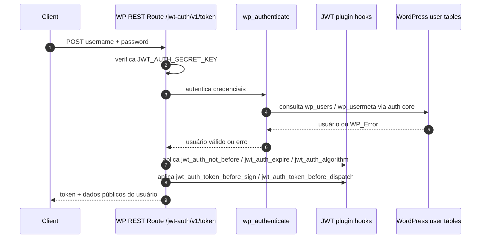

# Análise Técnica - Rota `jwt-auth/v1/token`

## Resumo Executivo

A rota `jwt-auth/v1/token` do WordPress não é um endpoint de consulta de dados. Ela é um endpoint de autenticação que troca credenciais do usuário por um JWT assinado pelo site.

Ponto importante: na implementação atual a rota está registrada como `POST`, não `GET`. Se o cliente estiver chamando `GET /jwt-auth/v1/token`, isso não corresponde ao código do plugin e tende a falhar.

## Onde a rota está implementada

- Plugin JWT: [public/class-jwt-auth-public.php](../wp/wp-content/plugins/jwt-authentication-for-wp-rest-api/public/class-jwt-auth-public.php)
- Bootstrap do plugin: [jwt-auth.php](../wp/wp-content/plugins/jwt-authentication-for-wp-rest-api/jwt-auth.php)
- Filtro que bloqueia usuários pendentes: [src/class-plugin.php](../wp/wp-content/plugins/headless-secure-registration/src/class-plugin.php)
- Status de ativação do usuário: [src/class-activation-service.php](../wp/wp-content/plugins/headless-secure-registration/src/class-activation-service.php)

## Responsabilidade da rota

O endpoint faz três coisas:

1. Valida se o JWT está configurado no WordPress.
2. Autentica o usuário com `wp_authenticate()`.
3. Gera e retorna um token JWT com dados básicos do usuário.

Não há leitura de CPT, taxonomia, preço, moeda ou país nessa rota. O escopo dela é autenticação.

## Fluxo da requisição



## Parâmetros recebidos

### Body

- `username`: string obrigatória.
- `password`: string obrigatória.

### Observações importantes

- O handler usa `WP_REST_Request::get_param()`, então o valor pode vir do corpo, query string ou form payload, mas o uso real é login via `POST`.
- Não há schema formal de request definido no plugin.
- Não existem parâmetros extras documentados para essa rota.

## Validações que existem hoje

### 1. Configuração obrigatória

O endpoint falha com `403` se `JWT_AUTH_SECRET_KEY` não estiver definido no `wp-config.php`.

### 2. Autenticação do WordPress

O login é delegado para `wp_authenticate($username, $password)`.

Isso significa que a validação real depende do comportamento padrão do WordPress e de filtros de autenticação ativos no site.

### 3. Bloqueio de usuário pendente

O plugin `headless-secure-registration` adiciona um filtro em `authenticate` e impede login quando o meta `hsr_activation_status` está como `pending`.

### 4. Algoritmo suportado

O plugin só assina o token se o algoritmo configurado estiver na lista suportada. O default é `HS256`, mas o plugin aceita outros algoritmos compatíveis com a biblioteca JWT.

### 5. Validações implícitas do token

Na validação interna do JWT, o plugin ainda confere:

- `iss` igual à URL do site.
- Presença de `data.user.id`.
- Token legível e não corrompido.

## Estrutura de resposta

### Sucesso

O retorno padrão é:

```json
{
  "token": "<jwt>",
  "user_email": "user@example.com",
  "user_nicename": "username",
  "user_display_name": "Display Name"
}
```

### Erros

Os erros mais relevantes observados no código são:

- `jwt_auth_bad_config` com `403` quando o secret key não existe.
- `[jwt_auth] user_not_found` ou `[jwt_auth] wp_authentication_failed` com `403` quando as credenciais falham.
- `account_pending_activation` com `403` quando o usuário ainda não ativou a conta.
- `jwt_auth_unsupported_algorithm` com `403` quando o algoritmo não é aceito.
- `jwt_auth_invalid_token` e erros relacionados à validação do token para uso em requests autenticadas.

## Regras de negócio escondidas no WordPress

### 1. Token com expiração configurável

Por padrão o JWT expira em 7 dias. Isso pode ser alterado por filtro (`jwt_auth_expire`).

### 2. Token com janela de ativação

O `nbf` é calculado com o filtro `jwt_auth_not_before`. Em regra fica igual ao momento da criação.

### 3. Payload do token é mutável

Antes de assinar, o plugin aplica `jwt_auth_token_before_sign`, permitindo adicionar claims personalizados.

### 4. Response também é mutável

Antes de enviar a resposta, o plugin aplica `jwt_auth_token_before_dispatch`.

### 5. Autenticação por bearer token no restante da API

O mesmo plugin intercepta requests REST com `Authorization: Bearer <token>` e converte o token em usuário autenticado via `determine_current_user`.

### 6. CORS opcional

Se `JWT_AUTH_CORS_ENABLE` estiver habilitado, o plugin ajusta headers de CORS para suportar requests autenticados no browser.

## Dependências existentes no WordPress

### Plugin principal

- `jwt-authentication-for-wp-rest-api`

### Plugin que interfere no login

- `headless-secure-registration`

Esse segundo plugin é relevante porque bloqueia login de usuários com ativação pendente.

### WordPress core

- `wp_authenticate()`
- `wp_users`
- `wp_usermeta`

### Tabelas e consultas

Para esta rota, não há evidência de consulta direta a tabelas customizadas, CPTs ou taxonomias.

O caminho real passa pelo sistema de autenticação do WordPress, que lê dados do usuário em `wp_users` e metadados em `wp_usermeta`.

### Campos personalizados relevantes

O único campo de negócio diretamente relevante para o login é:

- `hsr_activation_status`

Esse meta é usado para negar o login quando o usuário ainda não foi ativado.

## Modelo de dados necessário

### Dados mínimos para autenticação

- Identificador de login do usuário.
- Hash de senha armazenado no WordPress.
- Email do usuário.
- Nome nicename e display name para resposta.

### Metadados relevantes para a regra de negócio

- `hsr_activation_status`

### Dados que não aparecem nesta rota

- Custom Post Types
- Taxonomias
- Campos de preço ou moeda
- Campos de país
- Tabelas customizadas específicas de checkout ou catálogo

## Mapeamento de migração

### WordPress

- Endpoint: `POST /jwt-auth/v1/token`
- Banco/tabelas utilizadas: `wp_users`, `wp_usermeta`
- Regras de negócio: validação de secret, autenticação WP, bloqueio de conta pendente, assinatura JWT, TTL configurável, filtros de mutação do token e da resposta
- Campos retornados: `token`, `user_email`, `user_nicename`, `user_display_name`

### Node.js

- Controller: `AuthController.login()`
- Service: `AuthService.authenticate()` / `JwtTokenService.issueToken()`
- Repository: `UserRepository` e, se necessário, `UserMetaRepository`
- Entities/Models: `User`, `UserMeta` ou modelo equivalente ao espelho de `wp_users`/`wp_usermeta`
- DTOs: `LoginRequestDTO`, `LoginResponseDTO`, `AuthErrorDTO`
- Validações: `username` obrigatório, `password` obrigatório, credenciais válidas, usuário não pendente, secret JWT configurado, algoritmo suportado

## Sugestão de implementação em Node.js

### Estrutura recomendada

- `Controller` recebe a requisição e valida apenas o formato básico.
- `Service` concentra a autenticação, regra de conta pendente e emissão do JWT.
- `Repository` consulta o usuário no banco via TypeORM.
- `Entity` representa o espelho mínimo de `wp_users` e `wp_usermeta` se a migração continuar usando a base WordPress.

### Regras que precisam ser preservadas

1. Rejeitar login sem configuração de secret JWT.
2. Rejeitar login com senha inválida.
3. Rejeitar login quando `hsr_activation_status = pending`.
4. Emitir JWT com `iss`, `iat`, `nbf`, `exp` e `data.user.id`.
5. Retornar os mesmos campos públicos do usuário para não quebrar o cliente.

### Ponto crítico de migração

O maior risco técnico está na senha.

O WordPress já possui o hash de senha no formato dele e o `wp_authenticate()` aplica a lógica nativa do core. Se a API Node.js passar a autenticar diretamente contra a base WordPress, ela precisará usar um verificador compatível com hashes do WordPress ou definir um processo formal de migração de senha.

Sem isso, o login pode quebrar mesmo com o banco correto.

## Possíveis problemas na migração

- Diferença entre `GET` esperado pelo cliente e `POST` real do WordPress.
- Incompatibilidade de hash de senha se a API Node.js não usar verificação compatível com WordPress.
- Perda das regras de filtro do plugin JWT, especialmente TTL, algoritmo e claims customizados.
- Regressão do bloqueio de usuário pendente se `hsr_activation_status` não for consultado.
- Divergência no formato da resposta, quebrando clientes front-end já integrados.
- Divergência no payload do JWT, impactando rotas protegidas que dependem de `iss` e `data.user.id`.

## Testes sugeridos na API Node.js

- Autenticação com credenciais válidas retorna token e dados básicos.
- Credenciais inválidas retornam `403`.
- Usuário com status `pending` recebe erro dedicado.
- Secret ausente bloqueia a emissão do token.
- Token gerado contém as claims mínimas esperadas.
- Resposta preserva o contrato atual do WordPress.

## Conclusão

A rota `jwt-auth/v1/token` é um endpoint estritamente de autenticação, sem dependências de catálogo, taxa, país ou preço. A migração para Node.js pode ser feita de forma limpa com arquitetura em camadas, mas precisa preservar dois pontos críticos: compatibilidade com a autenticação do WordPress e o bloqueio de usuários ainda pendentes.

Se a aprovação seguir, o próximo passo deve ser implementar a rota em Node.js com `Express + TypeORM`, mantendo o contrato de resposta e os mesmos critérios de autenticação.