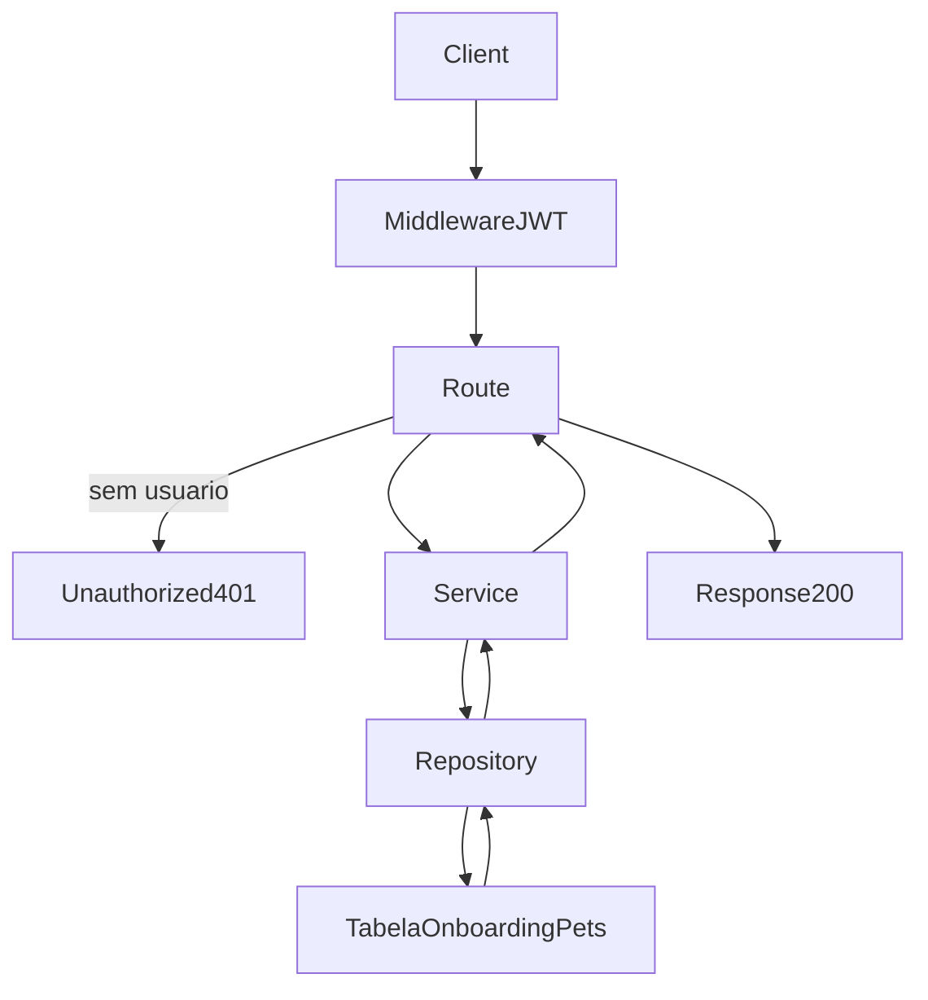

# Analise Tecnica - Rota Onboarding Pets (versao atual Node.js)

## Escopo

Rota atual no backend Node:

- GET /api/v1/onboarding/pets

Origem no front-end:

- eden-bowls/src/services/onboardingApi.ts (`listSessionPetsInApi`)

Arquivos analisados:

- eden-bowls-backend/src/api/routes/onboarding-pets.routes.js
- eden-bowls-backend/src/services/onboarding-pets.service.js
- eden-bowls-backend/src/infrastructure/repositories/onboarding-pets.repository.js
- eden-bowls-backend/src/infrastructure/entities/onboarding-pet.entity.js
- eden-bowls-backend/src/infrastructure/migrations/1700000000004-create-user-owned-onboarding-tables.js
- eden-bowls-backend/src/api/middleware/bearer-token.middleware.js
- eden-bowls-backend/src/app.js
- eden-bowls-backend/tests/onboarding-pets.routes.test.js
- eden-bowls-backend/tests/onboarding-pets.repository.test.js
- eden-bowls/src/services/onboardingApi.ts
- eden-bowls/src/pages/onboarding/Onboarding.tsx
- eden-bowls/src/pages/plan/Plan.tsx
- eden-bowls/src/pages/dashboard/pages/MyPets.tsx

## Responsabilidade da rota

A rota lista os pets ativos do usuario autenticado.

O modelo atual e user-owned: o pet nao vive mais no snapshot de uma sessao de onboarding. A listagem le a tabela `onboarding_pets` filtrando por `user_id` do JWT e ignorando registros com `deleted_at` preenchido.

Nao ha merge com historico de conta, pedidos WooCommerce ou outras sessoes. A resposta e apenas a lista persistida do usuario.

## Endpoint, Controller e permissao

### Endpoint

- Path: /api/v1/onboarding/pets
- Method: GET
- Registro: `registerOnboardingPetsRoutes`
- Callback: handler inline em `onboarding-pets.routes.js`

### Controller

- Exige `request.currentUser.id`
- Chama `OnboardingPetsService.listPets({ userId })`
- Retorna envelope `{ success: true, data }` com status 200

### Regra de acesso

A rota exige autenticacao JWT de usuario, nao token de sessao:

1. o middleware `buildBearerTokenMiddleware` le `Authorization: Bearer <jwt>`;
2. o JWT precisa ser valido e conter `data.user.id`;
3. sem usuario autenticado, a rota responde 401.

Erros de acesso comuns:

- 401 `unauthorized` — header ausente ou usuario nao resolvido
- 403 `jwt_auth_bad_auth_header` — header Authorization malformado
- 403 `jwt_auth_invalid_token` — JWT invalido ou expirado
- 503 — service ou banco indisponivel

O header legado `x-session-token` nao e mais usado nesta rota.

## Parametros recebidos

Path params:

- nenhum

Query params:

- nenhum

Headers:

- Authorization: Bearer token (obrigatorio)

Body:

- nenhum

## Validacoes que existem hoje

### 1) Autenticacao

- JWT obrigatorio
- `currentUser.id` obrigatorio

Erro:

- `Authentication is required.` -> 401
- corpo: `{ success: false, message: "Authentication is required." }`

### 2) Disponibilidade

- service injetado precisa existir
- data source TypeORM precisa estar inicializado

Erro:

- 503 com mensagem de service/repository/database indisponivel

### 3) Filtro de listagem

Nao ha validacao de dominio de pet nesta rota. O repository aplica:

- `user_id = ?`
- `deleted_at IS NULL`
- ordenacao por `created_at ASC`

Pets soft-deleted nao entram na lista.

## Fluxo da requisicao

1. GET /api/v1/onboarding/pets chega na rota
2. middleware JWT tenta popular `request.currentUser`
3. controller rejeita se nao houver usuario autenticado
4. service valida `userId` e chama o repository
5. repository executa SELECT na tabela `onboarding_pets`
6. cada linha e normalizada para o contrato de pet
7. controller responde 200 com `{ success: true, data: { pets } }`

## Estrutura de resposta

Envelope HTTP:

```json
{
  "success": true,
  "data": {
    "pets": [
      {
        "id": "pet-1",
        "name": "Milo",
        "breed": "Labrador",
        "age_years": 2,
        "age_months": 0,
        "age": 2,
        "weight_input": 10,
        "weight_unit": "kg",
        "weight": 10,
        "size": "large",
        "activity_level": "high",
        "pet_condition": "ideal",
        "neutered": true,
        "image_url": ""
      }
    ]
  }
}
```

Campos de cada pet:

- `id`: string (UUID gerado na criacao)
- `name`: string
- `breed`: string
- `age_years`: number
- `age_months`: number
- `age`: number (alias de `age_years`)
- `weight_input`: number (valor persistido na coluna `weight_input`)
- `weight_unit`: `kg` | `lb`
- `weight`: number (mesmo valor de `weight_input`)
- `size`: string
- `activity_level`: string
- `pet_condition`: string
- `neutered`: boolean
- `image_url`: string (vazio quando nao houver imagem)

Campos que o WordPress devolvia e esta rota nao devolve hoje:

- `session_id`
- `weight_kg`
- `deleted_at`
- `deleted_by_user_id`
- `deleted_reason`
- `type`

O frontend consome `data.pets` e mapeia para `PetDraft` em `mapSessionPetToDraft`.

## Regras de negocio atuais

1. Ownership por usuario
- o pet pertence a `user_id`, nao a uma sessao.

2. Soft delete na listagem
- registros com `deleted_at` sao omitidos.

3. Sem merge historico
- nao busca pets em pedidos, usermeta ou outras sessoes.

4. Sem conversao de peso
- `weight` e `weight_input` sao o mesmo numero persistido; nao ha `weight_kg`.

5. Sem inferencia de porte
- `size` volta exatamente como esta gravado.

6. `image_url` e apenas leitura
- a listagem devolve a coluna, mas as rotas de create/update atuais nao fazem upload.

7. Lista vazia e valida
- usuario autenticado sem pets recebe `{ pets: [] }`.

## Banco, queries e modelo

### Tabela

`onboarding_pets`

Colunas usadas nesta rota:

- `id`
- `user_id`
- `name`
- `breed`
- `age_years`
- `age_months`
- `weight_input`
- `weight_unit`
- `size`
- `activity_level`
- `pet_condition`
- `neutered`
- `image_url`
- `deleted_at`
- `created_at`

Indices relevantes:

- `idx_onboarding_pets_user_deleted` em (`user_id`, `deleted_at`)
- FK `fk_onboarding_pets_user_id` -> `wp_users.ID` com `ON DELETE CASCADE`

### Query

```sql
SELECT `id`, `name`, `breed`, `age_years`, `age_months`, `weight_input`, `weight_unit`,
`size`, `activity_level`, `pet_condition`, `neutered`, `image_url`
FROM `onboarding_pets`
WHERE `user_id` = ? AND `deleted_at` IS NULL
ORDER BY `created_at` ASC
```

### Entity TypeORM

- `OnboardingPet` em `onboarding-pet.entity.js`
- o repository desta rota usa SQL cru via `dataSource.query`, nao o repository TypeORM.

## Arquitetura Node atual

Controller:

- `registerOnboardingPetsRoutes`

Service:

- `OnboardingPetsService.listPets`

Repository:

- `OnboardingPetsRepository.listPets`

Entity:

- `OnboardingPet`

Auth:

- `buildBearerTokenMiddleware`
- `verifyJwtToken`

Wiring:

- `src/index.js` instancia repository + service
- `src/app.js` registra a rota depois do middleware JWT

Nao ha Prisma. A persistencia e TypeORM + SQL cru.

## Consumo no frontend

Função:

- `listSessionPetsInApi(authToken?)`

Telas:

- Onboarding: substitui o estado local pelos pets do usuario autenticado
- Plan: recarrega pets remotos para montar preview/selecao
- MyPets: lista os pets da conta

O nome da funcao ainda fala em "session", mas a chamada atual e user-owned e nao envia `sessionId`.

## O que mudou em relacao ao WordPress

| Antes (WP) | Hoje (Node) |
|---|---|
| GET /custom/v1/onboarding/session/:sessionId/pets | GET /api/v1/onboarding/pets |
| acesso por `x-session-token` | acesso por JWT Bearer |
| merge sessao + conta + pedidos | apenas pets do `user_id` |
| account wins em conflitos | nao ha merge |
| resposta com `session_id` + `pets` | resposta com `pets` |
| fallback por `checkout_order_id` e usermeta | removido |
| `weight_kg` no contrato | removido |

## Fluxograma



## Testes existentes

1. lista pets do usuario autenticado e devolve envelope com `data.pets`
2. 401 quando o Bearer esta ausente
3. repository filtra por `user_id` e `deleted_at IS NULL`

## Status

- Rota migrada e em uso no Node.js.
- Contrato atual e user-owned.
- Documentacao gerada a partir da implementacao atual, nao da analise WordPress.
