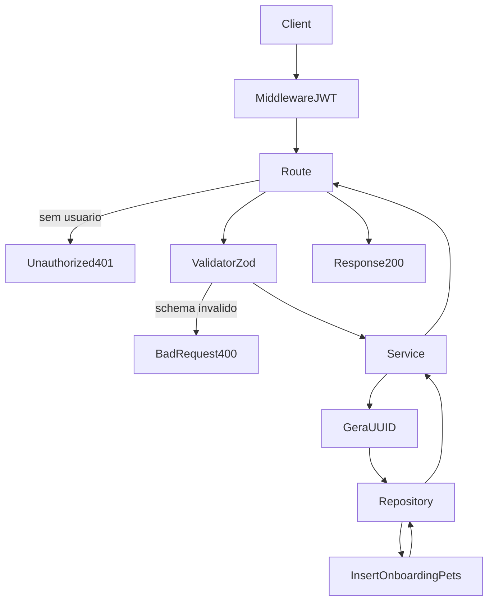

# Analise Tecnica - Rota Onboarding Create Pet (versao atual Node.js)

## Escopo

Rota atual no backend Node:

- POST /api/v1/onboarding/pets

Origem no front-end:

- eden-bowls/src/services/onboardingApi.ts (`createPetInApi`)

Arquivos analisados:

- eden-bowls-backend/src/api/routes/onboarding-pets-create.routes.js
- eden-bowls-backend/src/api/validators/onboarding-pets-create.validator.js
- eden-bowls-backend/src/services/onboarding-pets-create.service.js
- eden-bowls-backend/src/infrastructure/repositories/onboarding-pets-create.repository.js
- eden-bowls-backend/src/infrastructure/entities/onboarding-pet.entity.js
- eden-bowls-backend/src/infrastructure/migrations/1700000000004-create-user-owned-onboarding-tables.js
- eden-bowls-backend/src/api/middleware/bearer-token.middleware.js
- eden-bowls-backend/src/app.js
- eden-bowls-backend/tests/onboarding-pets-create.routes.test.js
- eden-bowls/src/services/onboardingApi.ts
- eden-bowls/src/pages/onboarding/Onboarding.tsx

Rota irma usada para criacao em lote:

- POST /api/v1/onboarding/pets/sync (`syncPetsInApi` / `syncLocalPetsToApi`)

## Responsabilidade da rota

A rota cria um pet persistido na conta do usuario autenticado.

Ela normaliza o payload com defaults, gera um UUID no backend e insere uma linha em `onboarding_pets` vinculada a `user_id`. Nao atualiza snapshot de sessao e nao processa upload de imagem.

## Endpoint, Controller e permissao

### Endpoint

- Path: /api/v1/onboarding/pets
- Method: POST
- Registro: `registerOnboardingPetCreateRoutes`
- Callback: handler inline em `onboarding-pets-create.routes.js`

### Controller

- Exige `request.currentUser.id`
- Faz parse do body com `parseOnboardingPetCreateInput`
- Chama `OnboardingPetCreateService.createPet({ userId, payload })`
- Retorna envelope `{ success: true, data }` com status 200

### Regra de acesso

A rota exige JWT de usuario:

1. `Authorization: Bearer <jwt>`
2. o token precisa expor `data.user.id`
3. sem autenticacao, responde 401

Erros de acesso comuns:

- 401 `unauthorized`
- 403 `jwt_auth_bad_auth_header`
- 403 `jwt_auth_invalid_token`
- 400 payload invalido (Zod)
- 503 service/banco indisponivel

## Parametros recebidos

Path params:

- nenhum

Headers:

- Authorization: Bearer token (obrigatorio)
- Content-Type: application/json

Body aceito pelo validator Zod:

- name?: string (trim, min 1 quando enviado)
- breed?: string (trim, min 1 quando enviado)
- age_years?: string | number
- age_months?: string | number
- weight?: string | number
- weight_unit?: `kg` | `lb`
- size?: `small` | `medium` | `large`
- activity_level?: `low` | `medium` | `high`
- pet_condition?: `underweight` | `ideal` | `overweight`
- neutered?: boolean

O frontend envia JSON via `buildPetPayload`. Nao ha multipart nesta rota.

## Validacoes que existem hoje

### 1) Autenticacao

- JWT obrigatorio
- `userId` obrigatorio no service

Erro:

- `Authentication is required.` -> 401

### 2) Schema Zod

Campos enviados precisam respeitar enum/tipo. String vazia em `name` ou `breed` falha o schema (`min(1)`), mas omitir o campo e permitido.

Erro:

- 400 `{ success: false, message: "Invalid request payload.", details: ZodIssue[] }`

### 3) Defaults aplicados depois do parse

Se o campo nao vier, o validator preenche:

- `name`: `''`
- `breed`: `''`
- `age_years`: `0`
- `age_months`: `0`
- `weight`: `0`
- `weight_unit`: `kg`
- `size`: `medium`
- `activity_level`: `medium`
- `pet_condition`: `ideal`
- `neutered`: `false`

Nao ha hoje as validacoes fortes do WordPress:

- faixa de idade 0..30 / 0..11
- faixa de peso 0.1..200
- unidade obrigatoria por pais (US=`lb`, BR=`kg`)
- campos obrigatorios de dominio
- upload de imagem

## Fluxo da requisicao

1. POST /api/v1/onboarding/pets chega na rota
2. middleware JWT popula `request.currentUser`
3. controller rejeita se nao houver usuario
4. validator normaliza o body e aplica defaults
5. service gera `crypto.randomUUID()`
6. repository faz INSERT em `onboarding_pets`
7. repository devolve o pet criado, com `image_url: ''`
8. controller responde 200 com `{ success: true, data: { pet } }`

## Estrutura de resposta

Envelope HTTP:

```json
{
  "success": true,
  "data": {
    "pet": {
      "id": "a1b2c3d4-e5f6-7890-abcd-ef1234567890",
      "name": "Luna",
      "breed": "Labrador",
      "age_years": 2,
      "age_months": 0,
      "age": 2,
      "weight_input": 12.5,
      "weight_unit": "kg",
      "weight": 12.5,
      "size": "large",
      "activity_level": "high",
      "pet_condition": "ideal",
      "neutered": true,
      "image_url": ""
    }
  }
}
```

O frontend consome:

- `petId` a partir de `data.pet.id`
- `imageUrl` a partir de `data.pet.image_url`

A resposta atual nao inclui `session`.

## Regras de negocio atuais

1. UUID gerado no backend
- o frontend nao envia `id`.

2. Pet e da conta, nao da sessao
- a linha nasce com `user_id` do JWT.

3. Peso e persistido como enviado
- `payload.weight` vai para a coluna `weight_input`
- a resposta devolve o mesmo valor em `weight_input` e `weight`
- nao ha conversao para kg nem coluna `weight_kg`

4. Sem upload de imagem
- o INSERT nao grava `image_url`
- a resposta sempre devolve `image_url: ''`

5. Sem `type = dog`
- o campo `type` nao existe no modelo atual.

6. Sem inferencia de size por raca
- se `size` nao vier, o default e `medium`.

7. Criacao em lote usa outra rota
- `POST /api/v1/onboarding/pets/sync` faz upsert por `local_id`
- o front usa isso em `syncLocalPetsToApi` quando ha pets locais sem `petId`

## Banco, queries e modelo

### Tabela

`onboarding_pets`

Colunas gravadas no INSERT desta rota:

- `id`
- `user_id`
- `name`
- `breed`
- `age_years`
- `age_months`
- `weight_input`
- `weight_unit`
- `size`
- `activity_level`
- `pet_condition`
- `neutered`

`created_at` e `updated_at` sao preenchidos pelo banco. `local_id` e `image_url` nao sao gravados neste INSERT.

### Query

```sql
INSERT INTO `onboarding_pets`
(`id`, `user_id`, `name`, `breed`, `age_years`, `age_months`, `weight_input`, `weight_unit`, `size`, `activity_level`, `pet_condition`, `neutered`)
VALUES (?, ?, ?, ?, ?, ?, ?, ?, ?, ?, ?, ?)
```

`neutered` e persistido como `1` ou `0`.

## Arquitetura Node atual

Controller:

- `registerOnboardingPetCreateRoutes`

Validator:

- `parseOnboardingPetCreateInput`

Service:

- `OnboardingPetCreateService.createPet`

Repository:

- `OnboardingPetCreateRepository.createPet`

Entity:

- `OnboardingPet`

O repository de create tambem implementa `syncPets`, usado pela rota de sync.

## Consumo no frontend

Funcao:

- `createPetInApi(pet, authToken?)`

Quando acontece:

- ao concluir o formulario de um pet novo no Onboarding, com usuario autenticado

Payload enviado:

```json
{
  "name": "Luna",
  "breed": "Labrador",
  "age_years": "2",
  "age_months": "0",
  "weight": "12.5",
  "weight_unit": "kg",
  "size": "large",
  "activity_level": "high",
  "pet_condition": "ideal",
  "neutered": true
}
```

`createPetInApi` envia JSON, nao FormData. A funcao `buildPetFormData` ainda existe no front, mas nao e usada por esta rota.

## O que mudou em relacao ao WordPress

| Antes (WP) | Hoje (Node) |
|---|---|
| POST /custom/v1/onboarding/session/:sessionId/pets | POST /api/v1/onboarding/pets |
| acesso por sessao | acesso por JWT |
| validacao forte de dominio | campos opcionais + defaults |
| unidade de peso por pais | aceita `kg` ou `lb` sem checar pais |
| conversao para `weight_kg` | so persiste `weight_input` |
| upload multipart `image` | sem upload |
| resposta `session` + `pet` | resposta so `pet` |
| snapshot da sessao | linha em `onboarding_pets` |

## Fluxograma



## Testes existentes

1. cria pet para o usuario autenticado e devolve `data.pet.id`
2. resposta nao inclui `session`
3. 401 sem Bearer

## Status

- Rota migrada e em uso no Node.js.
- Contrato atual e user-owned e JSON-only.
- Documentacao gerada a partir da implementacao atual, nao da analise WordPress.
