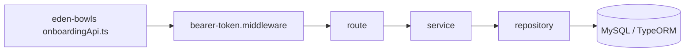

# Rotas de plano do onboarding no backend Node

Documentacao das rotas atuais do `eden-bowls-backend` que substituiram o fluxo WordPress baseado em sessao (`/custom/v1/onboarding/session/:sessionId/...`).

As analises antigas em `docs/plan` e `docs/rotes` descreviam a migracao proposta. Este diretorio documenta o que o backend Node faz hoje.

## Mudanca de modelo

| Aspecto | WordPress (legado) | Node (atual) |
|---|---|---|
| Identidade | `session_id` na URL | usuario autenticado (`request.currentUser.id`) |
| Auth | `x-session-token` ou Bearer de sessao | JWT Bearer de usuario |
| Persistencia | `wp_hsr_onboarding_sessions` + JSON columns | `onboarding_user_state` e `onboarding_pets` por `user_id` |
| Envelope | `{ success, data }` com `session_id` | `{ success, data }` **sem** `session_id` |
| Catalogo / nutricao | CMPB + WooCommerce + calculadora PHP | ainda stub em recommendation, snapshot, eligibility e pricing de preview |

O front (`eden-bowls/src/services/onboardingApi.ts`) ja consome os endpoints novos, sem `sessionId` na URL.

## Rotas cobertas

| Rota | Metodo | Auth | Persistencia real | Documento |
|---|---|---|---|---|
| `/api/v1/onboarding/recommendation` | GET | JWT obrigatorio | Nao (stub) | [ROTA_ONBOARDING_RECOMMENDATION.md](./ROTA_ONBOARDING_RECOMMENDATION.md) |
| `/api/v1/onboarding/plan/snapshot` | GET | JWT obrigatorio | Nao (stub) | [ROTA_ONBOARDING_PLAN_SNAPSHOT.md](./ROTA_ONBOARDING_PLAN_SNAPSHOT.md) |
| `/api/v1/onboarding/discount/eligibility` | GET | JWT obrigatorio | Nao (stub) | [ROTA_ONBOARDING_DISCOUNT_ELIGIBILITY.md](./ROTA_ONBOARDING_DISCOUNT_ELIGIBILITY.md) |
| `/api/v1/onboarding/plan/preview` | POST | Publica (JWT opcional) | Quote em `onboarding_quotes` | [ROTA_ONBOARDING_PLAN_PREVIEW.md](./ROTA_ONBOARDING_PLAN_PREVIEW.md) |
| `/api/v1/onboarding/plan-selection` | POST | JWT obrigatorio | `onboarding_user_state.plan_selection` | [ROTA_ONBOARDING_PLAN_SELECTION.md](./ROTA_ONBOARDING_PLAN_SELECTION.md) |

## Arquitetura comum



1. `createApp` registra as rotas em `src/app.js`.
2. `buildBearerTokenMiddleware` valida JWT em `/api/v1/*`, exceto `/api/v1/auth/token` e rotas legado `/api/v1/onboarding/session/...`.
3. Sem header `Authorization`, o middleware segue sem `request.currentUser`.
4. A rota decide se exige usuario. Quatro das cinco rotas abaixo exigem `request.currentUser.id` e respondem `401` se faltar.
5. `plan/preview` e a unica publica: aceita `userId` nulo e ainda assim cria quote.

## Envelope de erro padrao

Definido no error handler de `src/app.js`:

```json
{
  "success": false,
  "message": "Authentication is required.",
  "details": { "code": "unauthorized" }
}
```

- Payload Zod invalido: `400` com `details` = `error.issues`.
- `HttpError` com `details.code` nas rotas de onboarding: a propria rota devolve `{ success: false, message }` (eligibility tambem devolve `details`).
- Demais erros: status do `HttpError` ou `500` com mensagem generica.

## Fontes no codigo

- Bootstrap e wiring: `src/index.js`
- Registro de rotas e CORS/JWT: `src/app.js`
- Auth: `src/api/middleware/bearer-token.middleware.js`
- Tabelas: `onboarding_pets`, `onboarding_user_state`, `onboarding_quotes`
- Consumidor: `eden-bowls/src/services/onboardingApi.ts`
