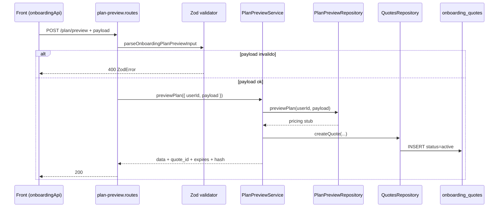

# Rota atual: Onboarding Plan Preview

## Escopo

Rota atual no backend Node:

- `POST /api/v1/onboarding/plan/preview`

Origem no front-end:

- `eden-bowls/src/services/onboardingApi.ts` (`fetchPlanPreviewFromApi`)

Arquivos principais:

- `src/api/routes/onboarding-plan-preview.routes.js`
- `src/api/validators/onboarding-plan-preview.validator.js`
- `src/services/onboarding-plan-preview.service.js`
- `src/infrastructure/repositories/onboarding-plan-preview.repository.js`
- `src/infrastructure/repositories/onboarding-quotes.repository.js`
- `src/infrastructure/entities/onboarding-quote.entity.js`
- `src/infrastructure/migrations/1700000000006-create-onboarding-quotes-table.js`
- `tests/onboarding-plan-preview.routes.test.js`
- `tests/onboarding-quotes.repository.test.js`

Rota legado WordPress (substituida):

- `POST /custom/v1/onboarding/session/:sessionId/plan/preview`

## Responsabilidade

Simular o preco do plano **sem persistir** `plan_selection`, e gravar um **quote** temporario para o checkout reutilizar o mesmo pricing.

Hoje a rota faz duas coisas:

1. Calcula (ainda via stub) totais, pets e `line_items`.
2. Persiste de verdade um registro em `onboarding_quotes` e devolve `quote_id`.

Diferenca essencial para `plan-selection`: preview nao grava o plano no usuario; so cria quote.

## Estado de implementacao

| Parte | Status |
|---|---|
| Endpoint publico + rate limit | implementado |
| Validacao Zod do payload | implementada |
| Persistencia de quote | implementada |
| Pricing / catalogo / recommendation | stub |
| Desconto no first month | stub (`first_month_total` = `grand_total`) |

O pricing stub ignora sabores/pesos reais e devolve sempre `USD` / total `20`.

## Endpoint, controller e permissao

### Registro

- Path: `/api/v1/onboarding/plan/preview`
- Method: `POST`
- Rate limit proprio: 30 req / 60s (`express-rate-limit`)
- Registrar: `registerOnboardingPlanPreviewRoutes`

### Controller

1. Exige service injetado (`503`).
2. Valida body com `parseOnboardingPlanPreviewInput` (Zod).
3. Chama `previewPlan({ userId, payload })`.
   - `userId` vem de `request.currentUser.id` se houver JWT.
   - Sem JWT, `userId` e `null`.
4. Responde `200` com o envelope.

**Nao exige autenticacao.** As cinco rotas de plano sao publicas; esta e a que tambem persiste quote com `user_id` nulo.

## Autenticacao

JWT e opcional.

- Sem `Authorization`: preview publico, quote com `user_id = null`.
- Com JWT valido: quote associado ao usuario.
- JWT invalido: o middleware rejeita antes da rota.

O front envia Bearer quando o usuario ja esta logado (`buildAuthHeaders`).

## Fluxo da requisicao



1. Front normaliza sabores/pesos e envia `subscription_term_months` + `pets`.
2. Zod rejeita termo diferente de 1/3/6 ou `pets` vazio.
3. Service pede pricing ao repository stub.
4. Service canonicaliza o payload, gera SHA-256 e cria quote com TTL de 10 minutos.
5. Resposta inclui pricing + metadados do quote.

## Parametros

### Headers

- `Content-Type: application/json`
- `Authorization: Bearer <jwt>` (opcional)

### Body

```json
{
  "subscription_term_months": 1,
  "pets": [
    {
      "pet_id": "pet-1",
      "pet_name": "Luna",
      "enabled": true,
      "selected_flavors": ["chicken"],
      "flavor_weights": [2]
    }
  ]
}
```

Schema Zod (`onboarding-plan-preview.validator.js`):

- `subscription_term_months`: literal `1 | 3 | 6`
- `pets`: array `min(1)` `max(20)`
- cada pet:
  - `pet_id` opcional, string ate 64
  - `pet_name` obrigatorio, 1–120
  - `enabled` boolean obrigatorio
  - `selected_flavors` array de strings, max 20
  - `flavor_weights` array de numeros finitos `>= 0`, max 20

O validator **nao** exige `selected_flavors` nao vazio nem `flavor_weights.length === selected_flavors.length`. Essas regras existiam no WordPress e hoje ficam so no front.

## Validacoes

| Camada | Regra | Status |
|---|---|---|
| Rota | rate limit 30/min | 429 |
| Validator | schema Zod | 400 |
| Service | repository de preview | 503 |
| Service | `quotesRepository` | 503 |
| Quotes repo | DataSource inicializado | 503 |
| Negocio | snapshot vs recommendation, catalogo, totais > 0 | **nao implementado** |

## Persistencia do quote

Tabela `onboarding_quotes` (migration `1700000000006`):

| Coluna | Uso |
|---|---|
| `id` | `q_` + UUID sem hifens |
| `user_id` | usuario do JWT ou `null` |
| `payload_hash` | SHA-256 do payload canonicalizado |
| `payload` | JSON enviado |
| `pricing` | JSON retornado pelo stub de preview |
| `status` | `active` na criacao |
| `expires_at` | agora + 600s |
| `consumed_at` | preenchido por `consumeQuote` |

Canonicalizacao: objetos tem chaves ordenadas antes do hash, para o mesmo payload gerar o mesmo `payload_hash` independente da ordem das keys.

O repository de quotes tambem expoe:

- `findActiveQuote(id)` — `status = active` e `expires_at > now`
- `consumeQuote(id)` — marca `consumed` uma unica vez

Nenhuma outra rota de onboarding consome o quote ainda. A infraestrutura ja esta pronta para checkout.

Preview **nao** grava `onboarding_user_state.plan_selection`.

## Estrutura de resposta

Sucesso `200`:

```json
{
  "success": true,
  "data": {
    "subscription_term_months": 1,
    "currency": "USD",
    "totals": {
      "grand_total": 20,
      "grand_total_monthly": 20,
      "first_month_total": 20
    },
    "pricing": {
      "grand_total": 20,
      "grand_total_monthly": 20,
      "first_month_total": 20
    },
    "grand_total": 20,
    "grand_total_monthly": 20,
    "first_month_total": 20,
    "pets": [
      {
        "pet_id": "pet-1",
        "pet_name": "Milo",
        "monthly_total": 20,
        "total": 20,
        "first_month_total": 20
      }
    ],
    "line_items": [
      {
        "pet_id": "pet-1",
        "pet_name": "Milo",
        "flavor": "chicken",
        "quantity": 2,
        "pack_size_grams": 500,
        "pack_size_label": "500 g",
        "variation_id": 100,
        "product_id": 200,
        "currency": "USD",
        "unit_price": 10,
        "line_total": 20
      }
    ],
    "quote_id": "q_a1b2c3...",
    "quote_expires_at": "2026-08-15T23:52:00.000Z",
    "quote_payload_hash": "sha256-hex"
  }
}
```

Campos novos em relacao ao WordPress: `quote_id`, `quote_expires_at`, `quote_payload_hash`.

`session_id` foi removido.

Payload invalido `400`:

```json
{
  "success": false,
  "message": "Invalid request payload.",
  "details": [/* issues Zod */]
}
```

## Camadas

| Camada | Classe / funcao | Papel |
|---|---|---|
| Route | `registerOnboardingPlanPreviewRoutes` | rate limit + Zod + delegacao |
| Validator | `parseOnboardingPlanPreviewInput` | schema de entrada |
| Service | `OnboardingPlanPreviewService.previewPlan` | pricing + quote |
| Preview repo | `OnboardingPlanPreviewRepository.previewPlan` | pricing stub |
| Quotes repo | `OnboardingQuotesRepository.createQuote` | INSERT real |

Wiring em `src/index.js`:

```js
const onboardingPlanPreviewRepository = new OnboardingPlanPreviewRepository();
const onboardingQuotesRepository = new OnboardingQuotesRepository(dataSource);
const onboardingPlanPreviewService = new OnboardingPlanPreviewService(
  onboardingPlanPreviewRepository,
  { quotesRepository: onboardingQuotesRepository }
);
```

## Regras de preco no stub

- `currency` sempre `USD`
- `grand_total` / `first_month_total` sempre `20`
- `subscription_term_months` ecoa o payload (default `1`)
- line item fixo: chicken, 2 un, 500 g, `unit_price` 10

Nao ha resolucao BR/BRL, matching de sabor/peso, nem desconto de first month.

## Consumo no front

```ts
export async function fetchPlanPreviewFromApi(payload, authToken?: string) {
  const response = await fetch(`${base}/api/v1/onboarding/plan/preview`, {
    method: 'POST',
    headers: buildAuthHeaders(authToken, true),
    body: JSON.stringify({
      subscription_term_months: payload.subscriptionTermMonths,
      pets: normalizedPets,
    }),
  })
  if ([404, 405, 501].includes(response.status)) return null
  return assertPlanPreviewContract((await response.json())?.data)
}
```

O front exige `grand_total`, `first_month_total` e totais por pet. Os campos de quote sao extras e nao quebram o contrato se o assert for permissivo nos campos conhecidos.

## Diferencas em relacao ao WordPress

| Tema | WordPress | Node atual |
|---|---|---|
| URL | `/session/:sessionId/plan/preview` | `/plan/preview` |
| Auth | token de sessao obrigatorio | publica; JWT opcional |
| Persistencia | nenhuma (so side effect de questionnaire) | quote em `onboarding_quotes` |
| Pricing | catalogo CMPB + WCPBC | stub USD 20 |
| Validacao vs recommendation | mismatch 422 | nao feita |
| Validacao de pesos/sabores | service 422 | so schema Zod basico |
| Totais zero | 502 contrato | nao validado |
| `session_id` | presente | removido |
| Quote | nao existia | `quote_id` + TTL 10 min |

## Testes existentes

`tests/onboarding-plan-preview.routes.test.js`:

1. Cria quote **sem** Bearer; service recebe `userId: null`.
2. Payload invalido (`term = 2`, `pets = []`) retorna `400` e nao chama o service.

`tests/onboarding-quotes.repository.test.js`:

1. INSERT aceita `user_id` nulo.
2. `consumeQuote` so atualiza quote `active` e nao expirado.
