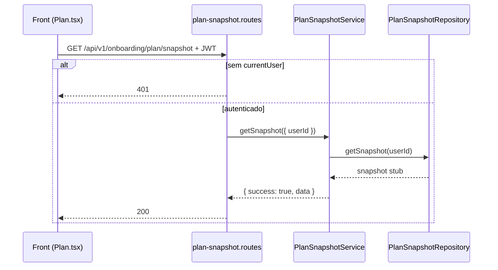

# Rota atual: Onboarding Plan Snapshot

## Escopo

Rota atual no backend Node:

- `GET /api/v1/onboarding/plan/snapshot`

Origem no front-end:

- `eden-bowls/src/services/onboardingApi.ts` (`fetchPlanSnapshotFromApi`)
- `eden-bowls/src/pages/plan/Plan.tsx`

Arquivos principais:

- `src/api/routes/onboarding-plan-snapshot.routes.js`
- `src/services/onboarding-plan-snapshot.service.js`
- `src/infrastructure/repositories/onboarding-plan-snapshot.repository.js`
- `tests/onboarding-plan-snapshot.routes.test.js`

Rota legado WordPress (substituida):

- `GET /custom/v1/onboarding/session/:sessionId/plan/snapshot`

## Responsabilidade

Devolver o snapshot autoritativo para montar a tela de plano:

1. Mercado: `country`, `currency`
2. Consumo simplificado por pet (`labels`, `consumption`, `pets`)
3. Catalogo de sabores (`flavor_options`)
4. Tabela de prazos e desconto (`plan_terms`)

E uma agregacao de recomendacao + catalogo + politica de desconto por prazo. O preview e a selecao usam esses dados depois.

## Estado de implementacao

HTTP, auth e envelope estao prontos. O repository **ainda e stub**: ignora `userId` e devolve um snapshot fixo (Milo / US / USD / Chicken).

Nao ha hoje:

- chamada a recommendation real
- leitura de `onboarding_pets`
- catalogo de sabores (ex-CMPB)
- hidratacao de questionario em GET
- validacao de `flavor_options` vazio (`502`)

`plan_terms` no stub ja replica a tabela legado: 1/3/6 meses com 10/25/40.

## Endpoint, controller e permissao

### Registro

- Path: `/api/v1/onboarding/plan/snapshot`
- Method: `GET`
- Registrar: `registerOnboardingPlanSnapshotRoutes`

### Controller

1. Exige service injetado (`503`).
2. Exige `request.currentUser.id` (`401 unauthorized`).
3. Chama `onboardingPlanSnapshotService.getSnapshot({ userId })`.
4. Responde `200` com o envelope.

## Autenticacao

```http
Authorization: Bearer <jwt-de-usuario>
```

Sem JWT a rota devolve `401`. Nao ha `x-session-token`.

O front envia o token via `buildAuthHeaders`. Se a rota responder `404`, `405` ou `501`, o cliente trata como "snapshot indisponivel" e retorna `null` (fallback local).

## Fluxo da requisicao



1. Front chama `fetchPlanSnapshotFromApi(authToken)`.
2. Rota autentica o usuario.
3. Service valida repository e `userId`.
4. Repository devolve o contrato fixo.
5. Front valida o contrato (`assertPlanSnapshotContract`) e usa `flavor_options`, `plan_terms` e consumo por pet.

## Parametros

Nenhum path/query/body. Contexto: `userId` do JWT.

## Validacoes

| Camada | Regra | Status |
|---|---|---|
| Rota | service injetado | 503 |
| Rota / service | `userId` presente | 401 |
| Service | repository injetado | 503 |
| Negocio | pets existentes, catalogo nao vazio | **nao implementado** |

## Estrutura de resposta

Sucesso `200`:

```json
{
  "success": true,
  "data": {
    "country": "US",
    "currency": "USD",
    "labels": {
      "daily": "Per day",
      "monthly": "Per month",
      "packs": "Packs"
    },
    "consumption": {
      "labels": {
        "daily": "Per day",
        "monthly": "Per month",
        "packs": "Packs"
      },
      "pets": [
        {
          "pet_id": "pet-1",
          "pet_name": "Milo",
          "daily": { "value": 200, "unit": "g", "grams": 200, "formatted": "200 g" },
          "monthly": { "value": 6000, "unit": "g", "grams": 6000, "formatted": "6,000 g" },
          "packs": {
            "count": 2,
            "pack_size_grams": 500,
            "pack_size_value": 2,
            "pack_size_unit": "pack",
            "formatted": "2 packs"
          }
        }
      ]
    },
    "pets": [
      {
        "pet_id": "pet-1",
        "pet_name": "Milo",
        "daily": { "value": 200, "unit": "g", "grams": 200, "formatted": "200 g" },
        "monthly": { "value": 6000, "unit": "g", "grams": 6000, "formatted": "6,000 g" },
        "packs": {
          "count": 2,
          "pack_size_grams": 500,
          "pack_size_value": 2,
          "pack_size_unit": "pack",
          "formatted": "2 packs"
        }
      }
    ],
    "flavor_options": [
      { "key": "chicken", "label": "Chicken" }
    ],
    "plan_terms": [
      { "subscription_term_months": 1, "discount_percent": 10 },
      { "subscription_term_months": 3, "discount_percent": 25 },
      { "subscription_term_months": 6, "discount_percent": 40 }
    ]
  }
}
```

`pets` e espelho de `consumption.pets`, como no legado.

O teste afirma que `data.session_id` **nao existe**.

## Camadas

| Camada | Classe / funcao | Papel |
|---|---|---|
| Route | `registerOnboardingPlanSnapshotRoutes` | auth + delegacao |
| Service | `OnboardingPlanSnapshotService.getSnapshot` | envelope |
| Repository | `OnboardingPlanSnapshotRepository.getSnapshot` | payload fixo |

Wiring em `src/index.js` sem DataSource:

```js
const onboardingPlanSnapshotRepository = new OnboardingPlanSnapshotRepository();
const onboardingPlanSnapshotService = new OnboardingPlanSnapshotService(onboardingPlanSnapshotRepository);
```

## Banco e fontes de dados

Nenhuma query. Catalogo e pets reais nao sao lidos.

`plan_terms` continua hardcoded no stub, igual ao WordPress.

## Consumo no front

```ts
export async function fetchPlanSnapshotFromApi(authToken?: string) {
  const response = await fetch(`${base}/api/v1/onboarding/plan/snapshot`, {
    method: 'GET',
    headers: buildAuthHeaders(authToken),
  })
  if ([404, 405, 501].includes(response.status)) return null
  const json = await response.json()
  return assertPlanSnapshotContract(json?.data)
}
```

O front exige `flavor_options` (ou equivalente). Sem sabores, trata como contrato invalido.

## Diferencas em relacao ao WordPress

| Tema | WordPress | Node atual |
|---|---|---|
| URL | `/session/:sessionId/plan/snapshot` | `/plan/snapshot` |
| Auth | token de sessao | JWT de usuario |
| `session_id` | presente | removido |
| GET com escrita | hidrata questionnaire | sem escrita |
| Catalogo CMPB | obrigatorio; vazio = 502 | stub com 1 sabor |
| Country/currency | BR/BRL ou US/USD | sempre US/USD no stub |
| `plan_terms` | 10 / 25 / 40 | igual no stub |

## Testes existentes

`tests/onboarding-plan-snapshot.routes.test.js`:

1. Usuario autenticado recebe snapshot sem `session_id`, com `currency`.
2. Sem Bearer retorna `401`.
